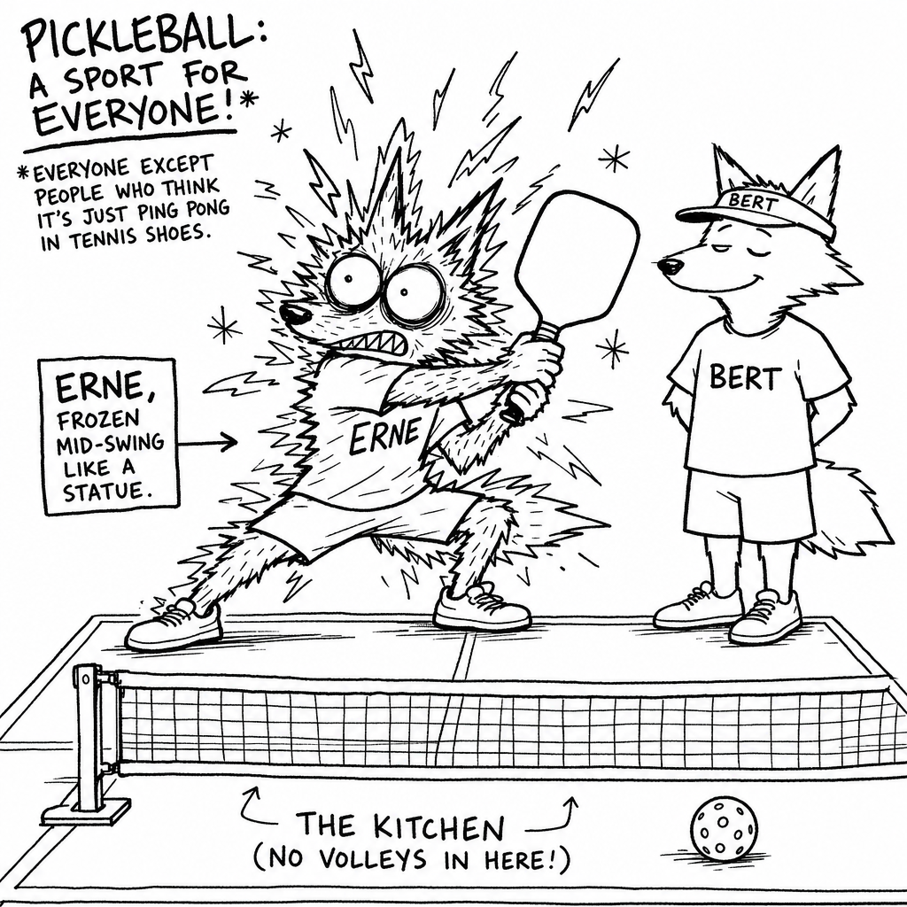
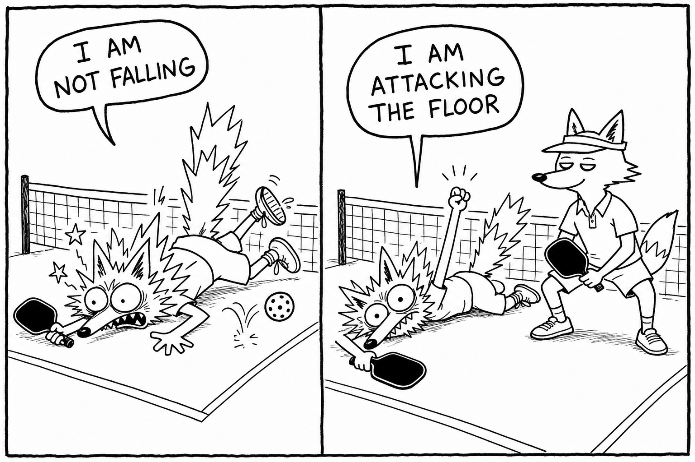
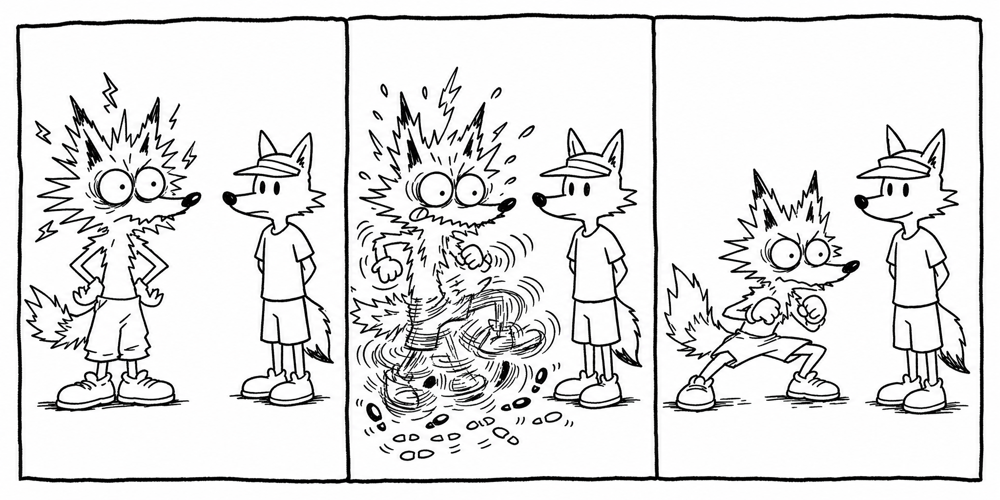

### Then, the small hop

The last piece is a little hop with an undignified name. Right as your opponent is about to strike the ball — not before, not after, but *as* — you make a small **split step:** a low hop that lands you light on both feet, knees soft, precisely at the moment of their contact. Land too early and you've already settled, flat and rooted and committed to standing exactly there; land too late and you're caught in the air and can't choose a direction at all. But land it right, and for one suspended instant you are balanced and loaded and free to push off toward anything.

It isn't a pickleball invention, or even a racket-sport one. It's the same coiled, weight-on-both-feet instant a tennis player has before a return, that a goalkeeper has before a penalty, that a boxer has, that a cat has in the half-second before it decides your houseplant has lived long enough. It's just what an animal does when it doesn't yet know which way it will have to go and means to be ready for all of them. A small split at the kitchen line, a larger one when you're scrambling back; every competent player alive does it before every shot, and you will never once catch them at it. That invisibility is the whole point — it's the quiet handshake of people who are better than you and too gracious to bring it up.

Bolt one free habit onto all of it: the moment after you hit, **recover** — drift back toward the middle of your space. The ball you weren't expecting is, with an almost supernatural reliability, already on its way to the exact patch of court you just wandered out of.

### Then, hold the line

Everything up to here has been general — feet that move, feet that go still, the little hop that marries the two. The net adds one twist that belongs to this sport and to no other, and it comes, the way most things do, from the Kitchen.

Out at the kitchen line — which is, by a comfortable margin, the best square of real estate on the whole court — you can't answer a wide ball the way a tennis player would, by charging forward to cut off the angle, because forward is the Kitchen and the Kitchen is lava. (Yes, that's a rule. Yes, I swore I'd never get to the rules. Look away.) So your footwork up here stops being *running* and becomes something smaller and stranger: a little sideways shuffle to get your body behind the ball, and then a *reach.* The Kitchen is a floor and not a ceiling — all ground, no sky — so you plant your feet just behind the line and lean your paddle out over it, as far as your wingspan and your balance can be talked into agreeing. Play as tall as you possibly can. Up here the reach is most of the offence you own, and it costs nothing but nerve.

And here is the single habit that will quietly cost you more points than any shanked swing ever could: **do not back up.** Every cell in a beginner wants to. A ball comes in low and dips toward your shoelaces, and the sensible, decent, deeply human response is to step back, let it bounce, buy yourself a breath. Don't. Retreating tips your weight onto your heels, ruins your angle, and hands the other team a kitchen twice the size to aim into. When a ball dies at your feet, **half-volley** it instead — scoop it off the very short hop, the half-second after it lands, without surrendering an inch — and stay exactly where you are, on the best ground there is.

There is one honest exception, and only one: a step back you *chose,* on purpose, having read a deep floating dink and decided to let it climb to a friendly height so you could attack it. That is strategy, and it's yours to use. What's forbidden is the *flinch* — the step nobody decided to take. Bert gives up the line about twice a year, both times on purpose. Erne surrenders it roughly every fourth ball, and could not, under oath, tell you why.

### And then, the actual point

There's more of this, and you'll gather most of it without trying — open stances and closed ones, the crossover step, the small step *backward* that lets a high ball climb to a height that's pleasant to hit. Don't drown in any of it tonight. Footwork has exactly one job, and looking athletic is nowhere on the list:

**it exists to put you where the ball is going, balanced, before the ball gets there.** That is the whole assignment. Every cue and drill above is only some way of buying that one quiet outcome.

And being where the ball is going turns out to be most of the entire sport — more than the swing, more than power, more than whatever the lean twenty-six-year-old across the net is currently admiring in himself. Two things conspire to get you there. The first is **anticipation:** knowing where the ball is headed before it has even left the other paddle — and that's the very sense you started growing back in your kitchen, bouncing a ball off the flat of your hand and learning, without any words for it, to read the thing. Out here it becomes watching the shoulder, the tilt of the paddle face, the tiny tell that every player gives away and none of them know they're giving — and starting to move *early,* while there's still time to get somewhere calm instead of merely arriving late and out of breath. The second is just **being there:** feet quietly to the spot, body set, before the ball comes down. A player who reads the ball a beat early and whose feet bring them to the place without any fuss will take apart a magnificent athlete who can do neither — and will do it on a Tuesday, in a thin rain, at sixty years of age.

We're going to keep coming back to these two — knowing where, and being there — for the rest of the book. They're as near to a religion as anything in here gets, and your plain, unglamorous, lifelong-ignored feet are how you say the prayers.

> ### 🥒 DRILL: Freeze
> Dink, or play out points, under a single iron rule: **the instant before you strike any ball, you must be completely stopped — balanced, feet set.** Still drifting at contact? Then you don't get to hit it; let it go, hand over the rally. It is honestly miserable for about a day. Then something shifts on its own: your feet begin arriving *early,* without being told to, because they've worked out privately that late feet mean no fun — and feet, it turns out, will do nearly anything for fun. That's the whole secret of the drill. It teaches your legs to beat the ball to the spot.

---
## (cut) the active/inactive feet journey

Most beginners turn up with dead feet — planted, flat on the heels, watching the ball travel past as though it were someone else's problem. They are, to put it plainly, statues; magnificent and doomed. So here comes the strangest request in the whole book, arriving as it does after three chapters of nudging you toward calm: for a little while, stop being Bert. Be Erne. Get up onto the balls of your feet and stay there, bounce, fidget, take small and constant and faintly ridiculous adjustment steps that go nowhere in particular. Be busy, be twitchy, be — heaven help us both — a little unwell about it.

You can't quiet a pair of feet that never learned to move in the first place; there's nothing there yet to quiet. So they have to go on a small journey, and they have to take it in order:

They begin **inactive** — the statue again, rooted, heavy on the heels. You crank them all the way over to **overactive** — the jitter, the fidget, the never-quite-still. And then, once they've found out they are *allowed* to move, they settle at last into **normal:** quiet, economical, the right number of steps and not one more. Inactive, then overactive, then normal — and you don't get to skip the middle one. You find the centre of a range by overshooting both of its ends, and there is no version of this where you reach calm feet without having first been, for a week or two, a genuine catastrophe. The economical feet that win games are built on top of the twitchy ones, never instead of them.

There's a mercy waiting at the far end of that road, and it deserves saying flat out, because nobody believes it until they feel it: **you have to move much less than you think.** Once your feet are *normal* — awake, but no longer auditioning for anything — you'll find the court is almost insultingly small, and that nearly everyone on it moves too much, never too little.
