# The Unhurried Guide to Pickleball
### a small book for people who would rather read than be yelled at across a net

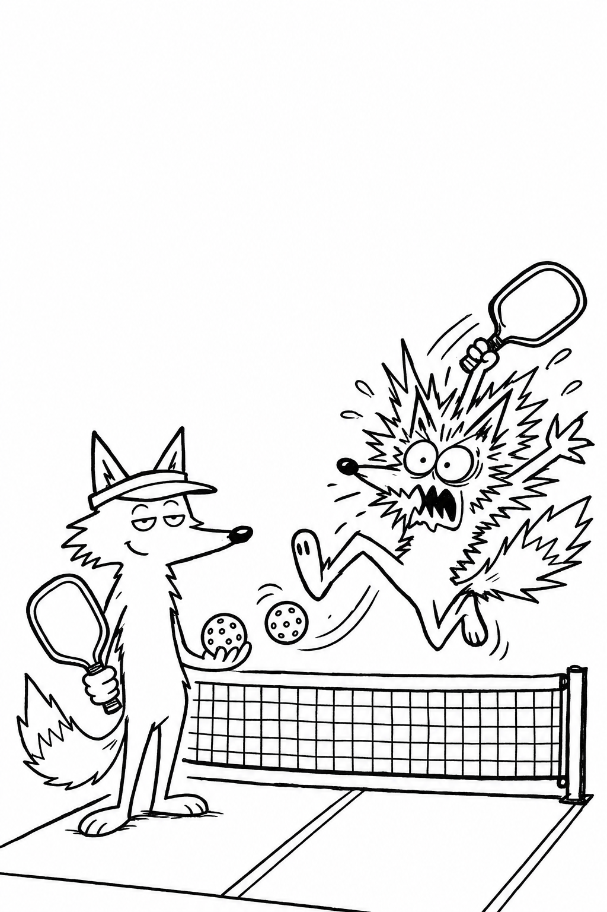

> *You have more time than you think. This is true of the ball. It is probably true of you.*

---

## A foreword, which is mostly Charles

There's a sport.

You hit a plastic ball — a hollow little planet, completely full of holes — with a paddle, over a low net, into a kitchen you are not allowed to cook in. When you hit it right it makes a sound like a tiny door being slammed by a tiny, satisfied man.

That's the whole sport. You basically know it already.

> **A DIGRESSION, COURTESY OF THE AUTHOR.** Charles wrote this. Charles spent ten years teaching people to write code, and then one ordinary afternoon he set down the keyboard, picked up a paddle, and became, essentially, this. He can't help seeing the sport as a programming language. *Tennis is C,* he'll tell you — magnificent, foundational, and it makes you weep for two years before it lets you have any fun. *Pickleball is Ruby* — a new quirky language people don’t take seriously, but started by asking: what if we made programmers feel delight? If a language could be forgiving, joyful, and gave you structure but also lots of empty space to imagine, like a haiku. Charles could go on. Charles will not go on. We have taken the keyboard away from Charles. We will not mention Ruby again. If you don’t know what Ruby is, you should read about it at why’s poignant guide to Ruby. That is, after all, what this entire thing was inspired by.
We mean that. We won’t. Well, we’ll try our best. 

> **WHAT IS THE CHUNKY PICKLE?** No. We're not explaining the Chunky Pickle. The Chunky Pickle is earned, not described. The patient get it. The impatient don't. You'll know when you have it, and you won't have it for a while. That's all anyone can responsibly say.

You get two guides. They're foxes. I don't know why they're foxes. I asked them and they just told me they’d always been foxes, and they never thought to change. 

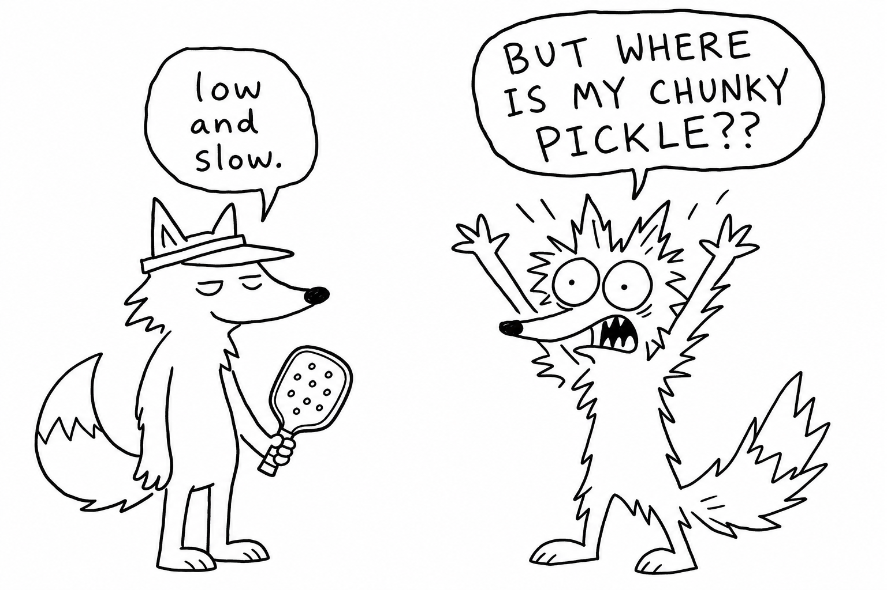

**Bert** is the calm one in the visor. Bert has, somehow, the inner life of a tortoise, which is a peculiar thing for a fox to have, and yet. Bert dinks. Bert waits. Bert has never once lost his temper and has, as a direct result, won everything on all days except Tuesday. Two words: *low and slow.* He says it so often you'll catch yourself saying it in the shower.

**Erne** is the other one. Erne has had several coffees. Erne wants to hit the ball as hard as a ball can be hit, every time, forever. Erne goes for the winner. Erne loses the point. Erne has never been awarded the Chunky Pickle and we've stopped promising him he will be. Erne is all of us. Even on Tuesdays. 

When you want to do something flashy — that's Erne. When you don't — that's Bert. The whole game is the argument between those two. So, I suspect, is most of everything. But we said we'd go slow.

> **A NOTE ON THE MULTIVERSAL NATURE OF BERT AND ERNE.** You'll notice, as you go, that Bert and Erne do not look *exactly* the same from drawing to drawing. We want to be clear these are not mistakes: our illustrator works by reaching through a small hole into a **neighbouring dimension** and sketching whatever Bert and Erne happen to be doing *over there* — and the foxes of the adjacent realities are, frankly, a little careless about their own continuity. It is the same two foxes. They are merely multiversal. It's fine. Everyone involved has made their peace with it.

One more thing, and then we start. I'm going to call you **Pemberton.** I have to call you *something* — the second person gets lonely after a while — and you didn't leave a name. And, Pemberton, between us, before we go any further: I'm not completely sure I'm the right person to be teaching you this. Sure, I have an official Racketpro Pickleball Coaching Level 1 Certificate. You can find it on my LinkedIn profile. That belongs there. But the rest of it — the foxes, the dimension, whatever's happening with the pickle — I’m not sure it belongs anywhere. But you're here, and the foxes are here, and it would be rude to stop now.

Low and slow, Pemberton. Here we go.

---
## Part — Before the Ball

You thought we would start with the rules. You were wrong, Pemberton. And this won't be the first time you'll be wrong — but it's a fine place to begin, because being a little wrong and carrying cheerfully on anyway is the most pickleball thing you will ever do.

We are not starting with the rules. We're starting with the *joy* — and with the strange, true fact that most of this sport happens in your head and your nerve and your feet long before it ever happens on your paddle. And you'll properly get to know the two voices you met a few pages back — the ones you'll be playing alongside for the rest of your life.

The written rules can wait. They're in the very next part, and you're allowed to skip them. The joy cannot wait. It never could.

First, we start with Bert and Erne. Wait, no, we start with you, Pemberton. 
---
## Chapter — Slam the Door

You have slammed a door, Pemberton. I know this about you. You’ve also, at least once, danced along to a song you liked, and when somebody yelled *put your hands in the air,* you put your hands in the air. Go on — do both right now. Not at the same time. Unless you can, in which case: blow my mind.

There. That was **awesome.** Genuinely. Even if you only did it in your head.

And here's the thing: you didn’t need a book for any of that. It didn’t matter how strong you were, or how young, or how fast, or whether it happened to be a Tuesday. Pickleball is, more or less, a door-slam and a hands-in-the-air stitched together over a low net. Which means the raw materials are already in you, and have been for years. Here’s the strange part: it’s the hands-in-the-air half — the loose, *I don’t especially care* half — where you’ll have the most fun, and, not by coincidence, play your best.

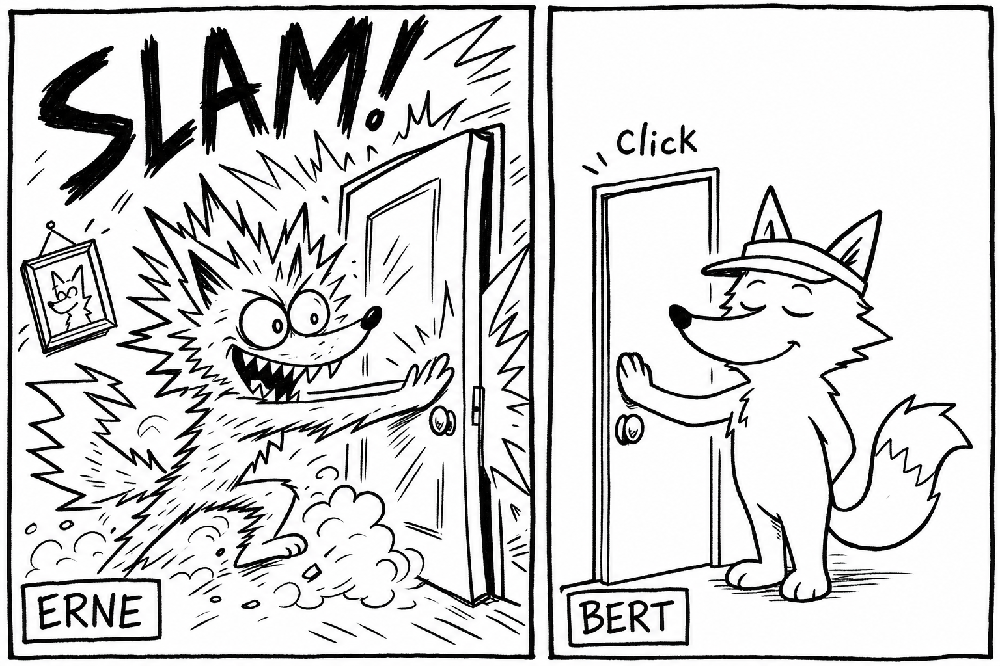

The first thing you’re going to slam the door on — gently, but all the way shut — is the idea that you’re going to win every point. That you’ll hit every shot, and be Bert, and earn the Chunky Pickle, and make every day a Friday. You won’t. Pickleball is a journey, and it is specifically a journey *through failure* — exactly the right amount of it. You’re going to taste success. You’re going to taste failure. You are, on at least one afternoon, going to experience honest heartbreak. At some point you will play an entire game and the final score will be 11 to 0.

You’re going to be the zero.

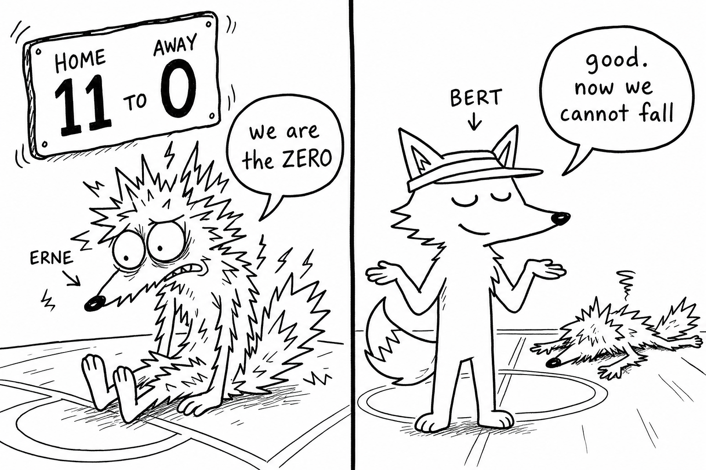

At some point you’ll play someone who takes the whole thing far too seriously. You’ll play someone whose every ball is somehow in, and every one of yours is somehow out.

You’re going to move your feet too much. Then, a week later, you won’t move them nearly enough.

And here’s the turn, Pemberton — the one I’d circle in red if this were that kind of book: none of that is the bad part. The zero. The person who calls all your balls out. The feet that won’t behave. That isn’t the *price* of pickleball. That *is* pickleball. Every one of those things is a thing you *noticed* — and the noticing is the whole game.

Go back to the hands in the air. You threw them up a second ago — or you pictured it, same thing. So: what angle are your arms at? Which one went up first? Are they the same? You have no idea. You’ve thrown your hands in the air ten thousand times in your life and not once asked.

That’s the secret nobody prints on the box. Pickleball is not, mostly, played with a paddle. It’s played with your *attention.* You’re going to start noticing things you’ve spent a whole life not noticing — which foot your weight is on, the exact half-second before your opponent’s paddle moves and you somehow *know* where the ball is going. You are going to think about your hips and your knees and your feet in ways you have never once thought about them in your entire life of *having* hips and knees and feet.

And underneath all of it, a hundred times a minute, a small voice rolls a die. *Go for it? Let it bounce? Hard? Soft? His backhand? Wait?* You’ve already met the two doing the arguing — Erne wants the winner, Bert wants the next shot — and you’ll hear them on every ball you ever hit.

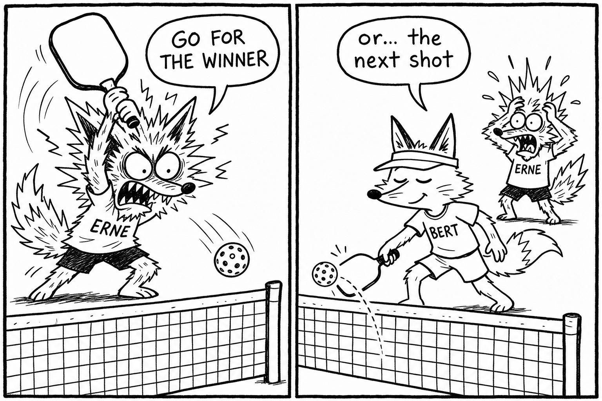

Here’s the good news: you’re going to do all of this *without thinking about it.* It stops being homework and turns into a sense, like hearing. And — this is the part that still gets me — it’s going to be *fun.*

You thought this was going to be a book about pickleball. Not a book about meditation. And you’re right. It’s a book about pickleball.

So let’s get to the rules.

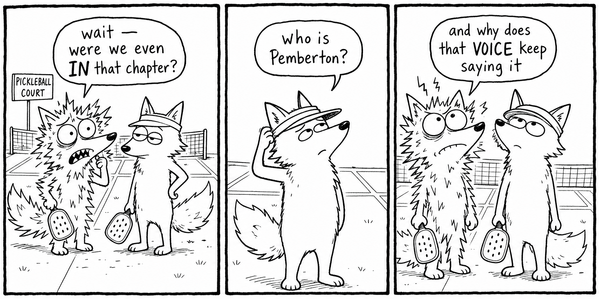

---
## Chapter — First, Touch the Ball

I lied.

I said the rules were next. They aren’t. I feel fine about it, and you will too in about a minute — and anyway, lying to Pemberton is a tradition now, and traditions are sacred. We *will* get to the rules. I promise. The rules aren’t going anywhere; that is more or less the entire point of rules.

But you cannot read your way into this sport, and I’m not going to let you try. So before another word: go get a ball and a paddle.

You don’t have one? Fine. You will eventually — you’ll own more paddles than any reasonable person can justify, and we’ll get to that, Erne *especially* will get to that — but right now, anything does. A ball and a wadded-up sheet of paper. A ping-pong ball and the back of a hardcover. Whatever’s within reach that can hit a thing. The equipment is not the point yet. Your hand is the point.

Got something? Good. Bounce the ball straight up off it, a tiny basketball dribble run in reverse. **Ten times, palm up.** Then flip your hand over — **ten times, palm down,** tapping it up off the back of your hand. Then **ten more, switching every single time:** up, down, up, down, up.

This is easy. It’s *supposed* to be easy. And if it isn’t easy yet — good. That’s not failure, that’s information, and information, as we have agreed, is the whole game.

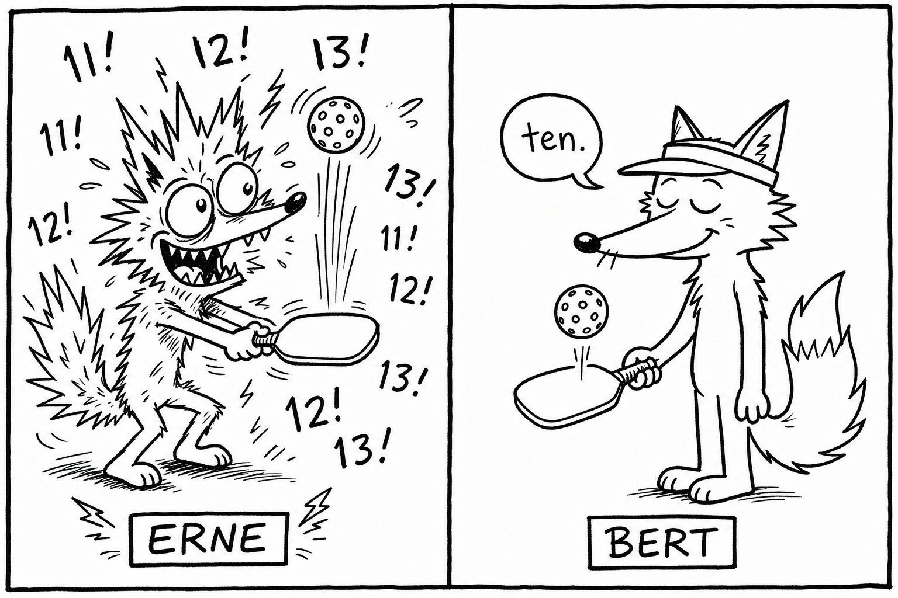

> **🥒 DRILL: THE WASTEBASKET TEST.** Are you still doing this with a wadded-up ball of paper? Then it went well, I’m proud of you, and now you have to stop. Crumple it tighter. Find a wastebasket. Line up the shot. *Kobeee.* Now go buy an actual pickleball — plastic, full of holes, the cheapest pack on the shelf. The paper got you this far. The paper cannot take you further. A surprising number of things are like that — training wheels; the cardboard box a cat likes more than the cat toy; the booster rocket that does all the screaming and then drops quietly into the sea while the crowd cheers for the part still going up; scaffolding; the chrysalis, which I bring up only because it is the one nature actually *eats* its old self to build; the tutorial level; the substitute teacher you had a small, doomed crush on; the version of you that, eleven minutes ago, agreed to learn pickleball. You thank them. You let them go. **Anyway.** Go pick up that wad of paper. It did not go in. I watched the whole arc of it. I saw you miss the shot, *Pemberkobe.*

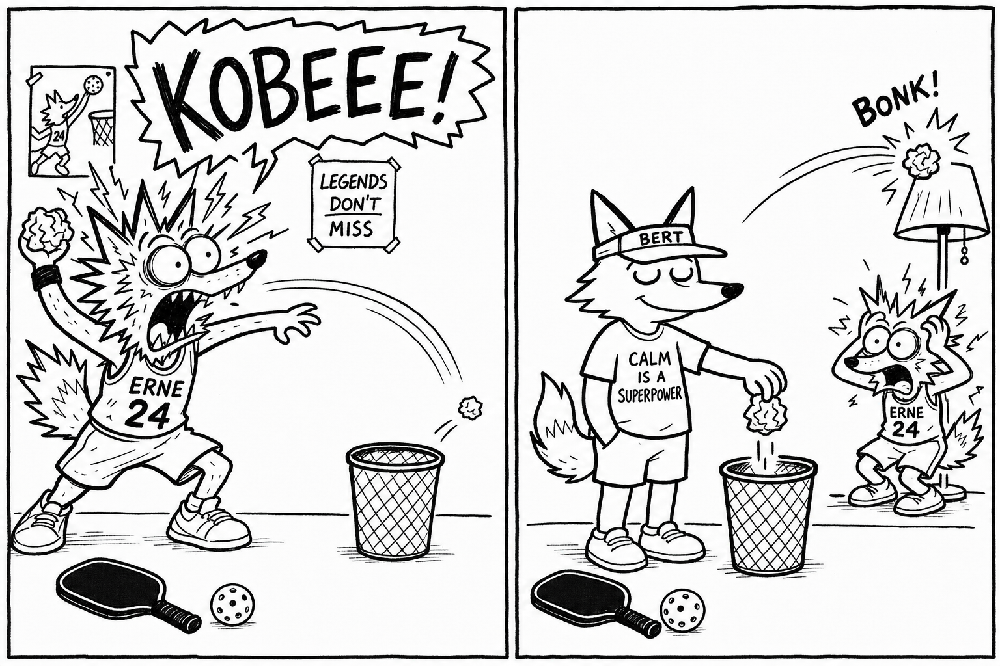

Now — pickleball.

Same drill, real ball, except stop counting and start *feeling.* Where does the ball go when you do nothing? Where does it go when you tilt the face a hair? Work out how to send it high. Then dead straight. Then a little to the left, on purpose, because you said so. Make it do what you tell it.

> **WHY THE HOLES?** They aren't a manufacturing accident — they're the whole personality. The holes drag against the air and keep the ball slow and low and honest, which is the only reason a sport this gentle is physically possible; a solid ball would turn pickleball into a knife fight. Indoor balls have **26** big holes, outdoor ones **40** smaller. Which means somebody, somewhere, *counted.* Somebody fought in a meeting for the fortieth hole, and won, and drove home that night to people who would never fully understand. I think about that person more than I think about some of my own relatives.

And pay attention — there’s that word again, it’s going to keep happening — to all the rest of it. When you miss, *why* did you miss? Too early, too flat, eyes already somewhere else? Some hits are going to feel *good* — a clean little *pock* that runs right up your arm like a secret someone told you. Some are going to make your elbow ask you a polite question. Both of those are the ball talking. Learn the language. It’s a short one. You’ll be conversational inside a week.

That’s the whole assignment. No net, no score, no opponent, no rules. Just you and a holed-out little ball, getting to know each other across a kitchen table.

*Now* we can talk about the rules.
---

## Chapter — Shake Hands With It

I lied again.

I ended the last chapter promising you, in italics, that *now* we'd talk about the rules. We won't. And here's where you and I turn a corner, because I am done apologizing for it. I apologized twice. It was unbecoming. The truth is I lied, and I'd do it again, and — let's finally be honest with each other — I am a little proud. Lying about where the ball is going is the *whole sport.* A man who won't even lie to you about his own table of contents has no business teaching it.

So the rules can keep waiting. Right now I need to talk to you about your hand.

But first I have to tell you about Pim.

**Pim.**

I won't tell you everything about Pim, because some of it is still mine. But I'll tell you it was long ago, and it was summer — the kind of summer that happens to you exactly once and then spends the rest of your life pretending to happen again. Pim had a laugh that arrived a half-second *before* anything was funny, as though Pim could see the joke coming over the hill. We were young enough to think this was simply how the world worked: that it came to you warm and ridiculous like this, and would keep coming.

And there was an evening. There is always *an evening.* We had walked much further than we meant to — the way you do when stopping would mean the evening was over — and somewhere along a road I could not now find on any map, without either of us deciding to, we held hands.

I want to be careful here, because I am not certain I have ever been happier than in the four hundred yards that followed. The entire machinery of me — the part that worries, the part that keeps score, the little spiky thing in the chest that is forever certain the good part is about to end — all of it just stopped, and stood in the road, and let me be a person holding another person's hand. The streetlights came on one at a time, like they'd been waiting for the cue. I remember thinking, with total conviction: *I will remember this exactly. Every detail. Forever.*

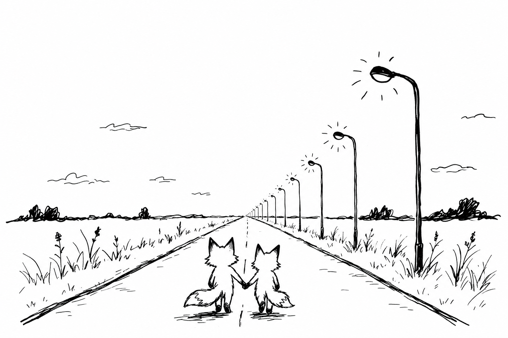

Pemberton.

Whose hand was on top?

Were your fingers laced through theirs, or folded over the back? Which thumb won? What was the *angle* of the wrist — square, or cocked a little, the way a hand has to cock to stay comfortable for four hundred yards? Was the grip loose? Did one of you hold on a touch too tight — and was it you?

You don't know. *I* don't know, and I was *there.* I could still draw you those streetlights. I could draw the crack in the pavement we both stepped over at the same instant and laughed about. The laugh that beat the joke — I have that on permanent loan. But the hand? The actual hand — the warm small machinery of whose fingers went where, the thing the whole evening was *for* — nothing. Not a single frame.

That is the entire tragedy of hands, Pemberton. And we are about to fix it.

Because here is a promise, and I do not make many: **your paddle is going to be even better than Pim.**

I mean that kindly. Pim was wonderful. But Pim left — they always leave; that's rather what makes it Pim — and your paddle is *not going to leave.* You are going to hold your paddle's hand on quiet weekday mornings and loud Saturday afternoons, for years, for the whole remaining stretch of your life that has a working shoulder in it. And this time — *this* time — you are going to notice every single thing about the holding. Whose hand is on top. The angle. The pressure. All of it. You are going to give a paddle the attention you never gave Pim, and the paddle, unlike Pim, is going to give it straight back to you — in the form of every ball you ever meant to send somewhere actually going there.

So let's shake hands with it.

Hold the paddle out in front of you, on edge, like you're being introduced to it at a slightly awkward party. Now shake its hand: palm flat against one side of the handle, fingers wrapping around, thumb settling along the other. That's the grip. That is *the* grip. The clipboard people call it the **Continental.** Everybody else calls it *shaking hands* — or, if greeting strangers unnerves you, *holding it like a hammer,* because your hand does precisely the same thing whether it means to make a friend or drive a nail. Handshake or hammer: pick the metaphor that frightens you less.

> **HOW HARD TO SQUEEZE IT.** Almost not at all. If a stranglehold is a ten and letting the paddle clatter to the floor is a zero, you want to live somewhere around a four — roughly the pressure you'd use to carry a hamster across a busy road, firm enough that you will certainly not drop the hamster, loose enough that you and the hamster arrive at the far curb with broadly compatible feelings about the journey. Clamp down past that and your paddle becomes a trampoline that flings every ball long, and, as a bonus no one asked for, slowly wires a faint electrical hum of future tennis elbow into your forearm. A loose hand with an honest wrist under it lets the face give a little as the ball arrives, which is most of what people are pointing at when they talk about someone having *soft hands*: they mean a person who, at the one moment it counts, is not trying to throttle a hamster.

> **A WORD ON THE NAME.** Why "Continental"? Nobody at the court knows. I looked into it so you wouldn't have to. The trail runs back into old tennis, where grips got named after *places* — "Eastern," "Western," "Continental" — for reasons that were perfectly clear to the people doing the naming and to no one since. It is the same magnificent confidence that gave us the **continental breakfast:** a thing named, grandly, after an entire continent, which turns out on arrival to be one hard muffin, a carafe of orange liquid, and a waffle iron you are expected to operate alone, on faith, in front of strangers. And yet — the continental breakfast is *free,* it is at every hotel on earth, and it is, against all reason, *enough.* The Continental grip is exactly that. It does not look like much. It is the one they give away for nothing. It will carry you all the way to the good part.

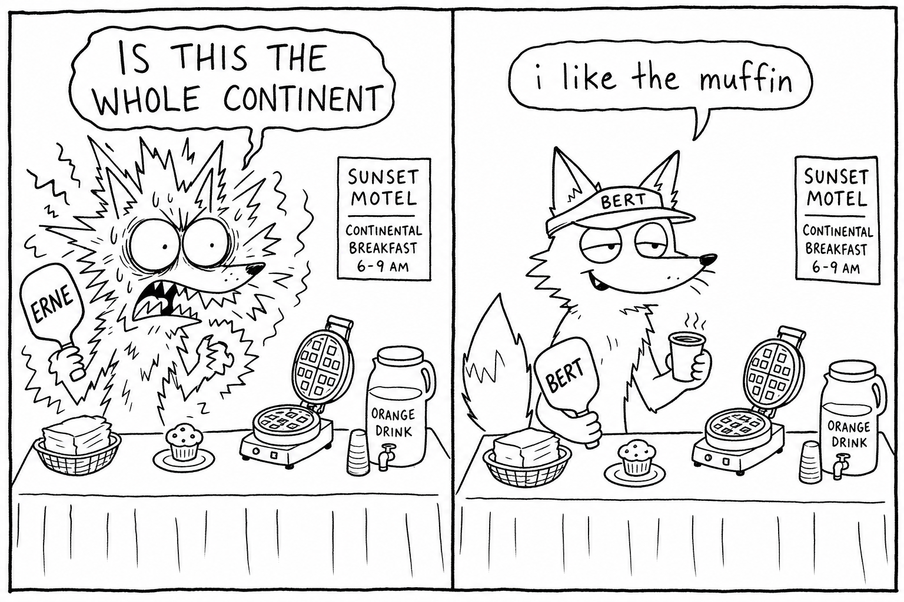

**Start here, and stay here.** Stay Continental long past the point where some helpful soul at the rack informs you that *serious* players switch to an Eastern grip for their forehand drive, or shift through three grips in a single rally like they're working a stick shift down a mountain. Maybe they do. You are not them. Twenty minutes ago you were tapping a ball off the back of your hand and losing count. The handshake grip will serve every shot you own — dink, volley, serve, reset, backhand, forehand — not each one *gloriously,* but each one *well enough,* from a single hand position you never have to scramble to change. One grip, every shot, no decisions. In a game that is mostly decisions, that is a mercy. The other grips are real, and someday you'll flirt with them, and that is allowed. Not today. Today we are faithful to the handshake.

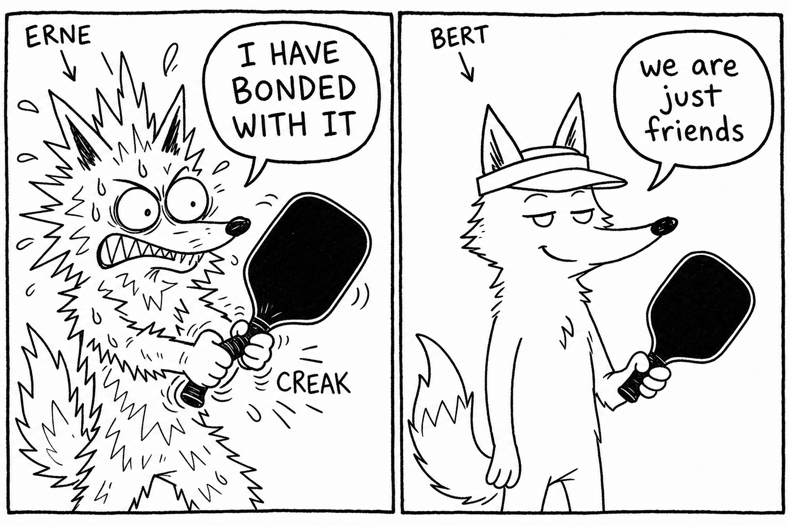

There's one more thing, and it matters more than it looks like it should: pick the paddle up the same way each time. The advice stays boring right up until you notice what it quietly does for you. When your hand finds the same grip on every shot, the paddle gradually stops feeling like an object you're holding and starts feeling like the end of your arm, so that you stop aiming the paddle and begin aiming your hand — and you already know how to aim your hand, the way you can point at the moon without ever once thinking about your finger. A paddle will get that familiar to you, but only for as long as you keep introducing yourself to it the same way; take its hand a little differently on every shot and it stays a courteous stranger who never quite knows where you meant to send the ball.

So introduce yourself properly. Right now, paddle in hand: rotate the handle in your palm. Feel the flat faces and the little ridged corners between them — the **bevels;** paddles have these subtle edges — and learn them the way your tongue learns a chipped tooth, without being told to. Find the handshake. Let it go. Find it again with your eyes shut. Again. You are building a thing your hands will keep long after your mind has wandered off to lunch, or mortality, or whether you left the stove on. You are giving something the attention you once owed Pim. Better late, Pemberton. Better here than never.

The rules. Tomorrow, I think. I want to say tomorrow — though you and I both know my record. For tonight, just hold the paddle's hand a few hundred times while you watch something with the other eye: the same grip, every time, until your hand could find it in the dark.

It is going to find it in the dark.

That, in the end, is the whole point of holding hands.

---
## Chapter — Footwork, the quiet thing that's actually the whole thing

Pemberton. Today — I want this on the record — I actually did it. I sat down, squared up the paper, cleared my throat, and I began. *Rule One,* I wrote. *The Kitchen is a seven-foot box in which you may not —*

And then I thought of you. Back in your own kitchen, the real one, with a ball and the flat of your hand, doing the bounce drill. Did you get the hang of it? Ten palm-up, ten palm-down, ten switching back and forth? I hope you did. I hope you stood there a little longer than the drill asked for, just because it had started to feel good.

So I put the pen down. The rules will keep — keeping is the one thing rules are reliably good at. You, out there getting a little better by the evening, will not. I think about you more than is strictly healthy for a narrator, and I gave up apologising for it some time ago.

So let me make it harder instead — which turns out to be the fastest way to show you what footwork even is. Try the same drill standing on a **skateboard** — not rolling, just balanced on it on the carpet. Still doable, isn't it? But you're suddenly spending half your attention on the board and only the other half on the ball. Now picture that same skateboard with **one wheel missing** — a raccoon worked it loose in the night, for purposes it has declined to share — so the deck tips and pitches with every breath you take. The drill falls apart. Your hands haven't forgotten a thing; the trouble is there's no longer a steady *you* underneath them to work from, and every motion you make is really just a frantic apology for the last thing the board did. And if even that is too gentle for you — fine, show-off — we can always set you on the deck of a small boat, in a large and badly behaved sea, and you can find out for yourself how much soft, accurate pickleball gets played up there.

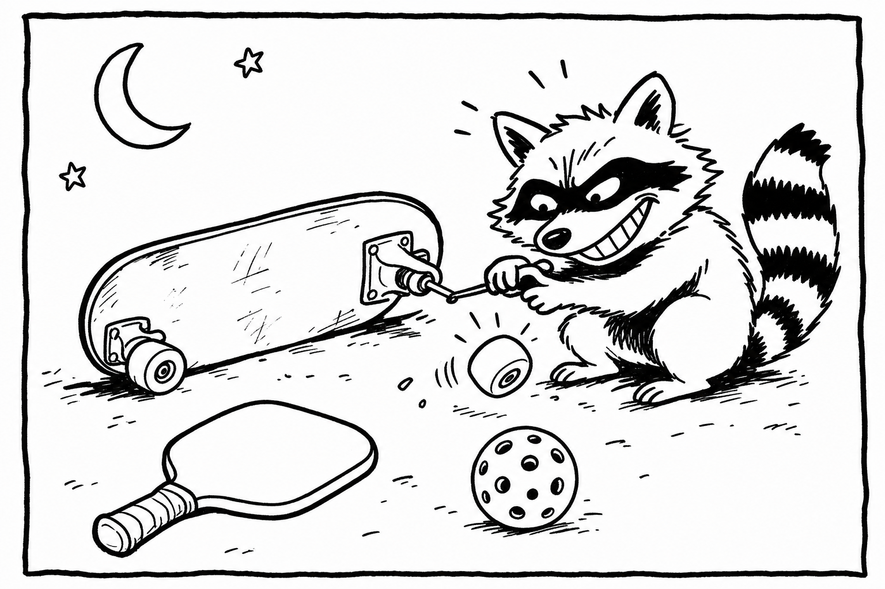

**Footwork is about stability.** Your feet are the only contractor you've got, and their entire job is to pour a small slab of still, dry ground under you — fresh, on demand, in the half-second before each shot — out on a court that behaves more and more like that one-wheeled skateboard the better your opponent plays. 

It comes down, in the end, to the two words Bert can’t stop muttering — *low and slow* — pointed straight at your feet: **go low, go slow.** The *low* comes first.

### First, be still

Stability is the goal, so let's start there. Almost every good shot you will ever hit comes off a base that was, at the instant of contact, completely still. Get that base wrong — strike the ball while you're still drifting sideways — and it will go somewhere, just rarely where you meant. And you cannot hit cleanly while falling over, however much of his career Erne has poured into proving you can.

Stillness has an address, and it's called **ready position.** I'd like you to live there.

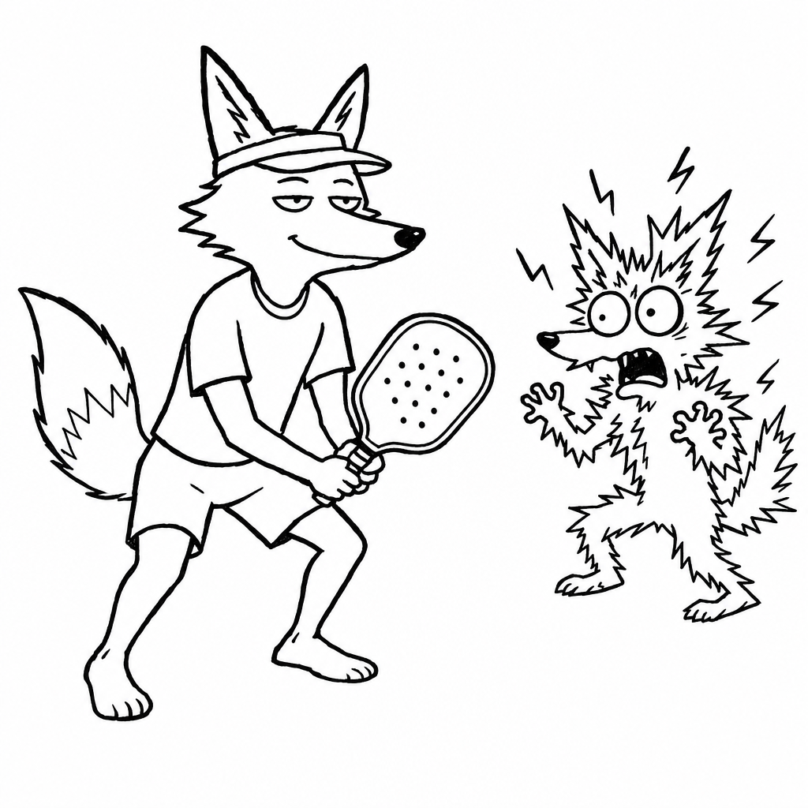

Here’s the shape. Feet a touch wider than your shoulders, toes turned slightly out, knees bent, weight tipped onto the balls of your feet — *nose over toes.* The paddle waits out in front of you at about waist height, *not* up by your face: held high, it can only come down, and good pickleball is hit gently *up.* Tilt it a hair toward your backhand — the side you can’t reach across yourself to cover in a hurry. And tuck your elbows in instead of winging them out: arms kept close rotate quicker and tire slower, the way a skater pulls hers in to spin faster. Assemble all of that, and you look like a person waiting, very politely, to be handed something heavy. That patient, half-folded, ready-for-anything crouch is the posture the whole sport is played from. That crouch is your *low.*

### Then, get to the ball

So perfect stillness, on its own, is just a handsome way to lose — you do still have to reach the ball that drops in a foot to your side. But here is the part almost nobody believes until they feel it: at the kitchen line, you move **much less than you think.** The court is almost insultingly small, and nearly everyone on it moves too much, never too little. That — unhurried, economical, a little lazy on purpose — is your *slow.*

Look at the actual ground. The whole court is twenty feet wide and forty-four long; you only defend half of it; and in doubles you split that half with a partner — so your name is really on about ten feet of width. Ten feet. That is a parking space. You are guarding a parking space, Pemberton — with a friend minding the one beside you — and still, somehow, people thunder around back there as if the floor had caught fire. And it shrinks *again:* as the two of you press up to the kitchen line and squeeze the angles shut, the slice that's genuinely yours collapses to something a lean and one honest step will cover. Up at the line, the patch of the world you are actually responsible for is closer to a ping-pong table than a tennis court. (There is a lob to fret about; we will fret later. The slow, holey ball hands you more time for it than your nerves will admit.) Stay balanced, and you can reach very nearly everything without travelling much of anywhere. You have more time than you think — I said so on the very first page, about the ball, and it turns out I was quietly talking about your feet the whole time.

<figure class="court-fig">
<svg viewBox="0 0 470 400" role="img" aria-label="A top-down half court split down the middle. On the right, Bert's feet move only about half a metre, though his half is three metres wide. On the left, Erne spirals out of control with absurd distances.">
<rect x="85" y="55" width="300" height="300" fill="#e9dfc2"/>
<rect x="85" y="55" width="300" height="92" fill="#dcc99e"/>
<g fill="none" stroke="#2b261e" stroke-width="1.6">
<rect x="85" y="55" width="300" height="300"/>
<line x1="85" y1="147" x2="385" y2="147"/>
<line x1="235" y1="147" x2="235" y2="355"/>
</g>
<line x1="85" y1="55" x2="385" y2="55" stroke="#2b261e" stroke-width="4"/>
<!-- Bert, right-side player: feet barely move -->
<rect x="285" y="152" width="50" height="16" rx="4" fill="#6f9150" fill-opacity="0.5" stroke="#4f6b4a" stroke-width="2" stroke-dasharray="5 3"/>
<circle cx="310" cy="152" r="6.5" fill="#2b261e"/>
<text x="310" y="143" text-anchor="middle" class="cl-pl">BERT</text>
<g stroke="#6b5f47" stroke-width="1">
<line x1="285" y1="138" x2="335" y2="138"/>
<line x1="285" y1="134" x2="285" y2="142"/>
<line x1="335" y1="134" x2="335" y2="142"/>
<line x1="347" y1="152" x2="347" y2="168"/>
<line x1="343" y1="152" x2="351" y2="152"/>
<line x1="343" y1="168" x2="351" y2="168"/>
</g>
<text x="310" y="131" text-anchor="middle" class="cl-dim">his feet: ~0.5 m each way</text>
<text x="356" y="163" class="cl-dim">0.3 m</text>
<g stroke="#6b5f47" stroke-width="0.8" stroke-dasharray="3 3">
<line x1="237" y1="196" x2="383" y2="196"/>
<line x1="237" y1="192" x2="237" y2="200"/>
<line x1="383" y1="192" x2="383" y2="200"/>
</g>
<text x="310" y="211" text-anchor="middle" class="cl-dim">his half &#8776; 3 m (the reach covers it)</text>
<!-- Erne, left-side, spiralling out of control -->
<path d="M154.0 256.0 L154.4 256.9 L154.5 257.9 L154.4 259.0 L154.1 260.2 L153.4 261.3 L152.4 262.3 L151.2 263.1 L149.8 263.7 L148.2 263.9 L146.4 263.8 L144.7 263.3 L143.0 262.4 L141.4 261.1 L140.2 259.5 L139.2 257.5 L138.7 255.3 L138.6 253.0 L139.0 250.6 L139.9 248.2 L141.4 246.0 L143.3 244.1 L145.7 242.6 L148.4 241.5 L151.3 241.0 L154.4 241.1 L157.5 241.9 L160.4 243.3 L163.1 245.3 L165.4 247.9 L167.1 251.0 L168.2 254.5 L168.6 258.2 L168.2 262.0 L167.1 265.7 L165.2 269.2 L162.5 272.3 L159.2 274.9 L155.4 276.8 L151.2 277.9 L146.7 278.2 L142.2 277.5 L137.9 275.9 L133.9 273.5 L130.3 270.2 L127.5 266.2 L125.5 261.6 L124.4 256.6 L124.3 251.5 L125.3 246.3 L127.3 241.3 L130.4 236.8 L134.3 232.9 L139.1 229.8 L144.4 227.7 L150.1 226.7 L156.0 226.9 L161.9 228.2 L167.4 230.8 L172.4 234.4 L176.7 239.0 L179.9 244.5 L182.1 250.6 L183.0 257.1 L182.5 263.7 L180.8 270.2 L177.7 276.3 L173.4 281.8 L168.1 286.3 L161.8 289.7 L154.9 291.9 L147.7 292.6 L140.4 291.8 L133.2 289.6 L126.6 286.0 L120.8 281.0 L116.0 275.0 L112.4 267.9 L110.4 260.3 L109.8 252.3 L110.9 244.3 L113.6 236.5 L117.9 229.4 L123.5 223.2 L130.4 218.2 L138.1 214.6 L146.6 212.6 L155.3 212.3 L164.0 213.8 L172.4 217.0 L180.0 221.9 L186.5 228.3 L191.7 235.9 L195.3 244.4 L197.2 253.7 L197.2 263.1 L195.2 272.5 L191.4 281.4 L185.9 289.5 L178.8 296.3 L170.4 301.6 L161.0 305.2 L151.0 306.9 L140.8 306.6 L130.8 304.1 L121.4 299.8 L112.9 293.5 L105.8 285.7 L100.4 276.5 L96.8 266.3 L95.4 255.5 L96.1 244.6 L99.1 233.9 L104.1 224.0 L111.0 215.2 L119.7 207.9 L129.7 202.4 L140.7 198.9 L152.2 197.8 L163.9 198.9 L175.1 202.4 L185.5 208.1 L194.7 215.8 L202.2 225.2 L207.7 236.1 L211.0 247.9 L211.8 260.2 L210.2 272.5 L206.1 284.3 L199.8 295.2 L191.3 304.7 L181.0 312.3 L169.3 317.8 L156.7 320.8 L143.7 321.3 L130.7 319.2 L118.3 314.5 L107.0 307.4 L97.3 298.1 L89.6 287.0 L84.2 274.5 L81.3 261.1 L81.2 247.3 L83.9 233.7 L89.2 220.8 L97.1 209.1 L107.2 199.1 L119.2 191.4 L132.5 186.1 L146.7 183.5" fill="none" stroke="#2b261e" stroke-width="1.5" opacity="0.85"/>
<path d="M146.7 183.5 C 110 150, 70 95, 50 60" fill="none" stroke="#2b261e" stroke-width="1.4" stroke-dasharray="3 3" opacity="0.85"/>
<circle cx="50" cy="60" r="2.6" fill="#2b261e"/>
<circle cx="150" cy="256" r="6" fill="#2b261e"/>
<text x="150" y="245" text-anchor="middle" class="cl-pl">ERNE</text>
<g fill="#2b261e" style="font-family:Caveat, cursive" font-size="14">
<text x="46" y="52" text-anchor="middle">ERNE: 12 m</text>
<text x="92" y="338" text-anchor="middle">ERNE: 1.6 km</text>
<text x="205" y="332" text-anchor="middle">ERNE: &#8734;</text>
</g>
<text x="235" y="376" text-anchor="middle" class="cl-dim">20 ft &#8226; 6.1 m</text>
</svg>
<figcaption>Bert's half is about three metres wide — but his feet only ever travel half of one of them, because the reach does the rest. Erne, across the centre line, is solving a larger and far more imaginary problem.</figcaption>
</figure>

So here is the practical whole of it — the part you can go and do this very afternoon. **Start at the kitchen line, and trust that you will almost never need more than a single step.** One step left, one step right, one step back — and far more often than any of those, no step at all, just a shift of your weight onto the foot nearest the ball. The coach who taught me this liked to hand a beginner one cruel little rule — *you may take exactly one step in any direction, and not a single one more* — and the beginner would discover, usually with some indignation, that they could still get to very nearly everything. So go and practise exactly that: a ball to your left, a ball to your right, a ball that nudges you back a step (to get *behind* it, mind — not to flee the line; those are two different things), and your only assignment on each one is to arrive *balanced,* and then drift home to your base. Left, right, back, balanced. That is most of footwork. The rest is footnotes.

> **A DIGRESSION, ON SHOES.** Since we are all the way down here at floor level: the one equipment opinion in this chapter I will hold with any heat is *don't play in running shoes.* They're built tall and soft to roll you *forwards,* and this is a sideways game on a court that keeps pretending to be the sea, so the first time you lunge for a wide ball they'll roll your ankle for you, free of charge. Tennis shoes are perfect. Basketball shoes are perfect. Anything flat and low and stuck to the floor — just not the running shoes. If you genuinely want names, the three I keep coming back to are **Adidas Barricades, Babolat SFX, Asics Gel-Resolution.** I lean to the heavier, more stable end of the rack, because I am not an especially nimble man and my knees have lately begun sending me letters; the light *speed* shoes are a joy, and I have turned an ankle in them more than once, so I have quietly chosen padding over fun. You may well be nimbler — most people are. But truly, it is not a big deal: court shoes, any of them, and we need never raise the subject again.

Pemberton, a quick word about the little boxes. Every so often — here, and in sections like this one all through the book — I am going to stop talking and hand you one of these, with a pickle stamped on the lid. They are drills. You are under no obligation whatsoever. But I will tell you, in confidence, that the people who actually *do* the things in the boxes are, with a regularity that borders on rude, the very same people quietly dismantling the people who only read them. Here is one worth doing.

> ### 🥒 DRILL: Catch and Toss
> Leave the paddle in the bag. You and a friend face each other across the net, each at your own kitchen line — and, the part that matters, you play **only half the court:** pick a side of the centre line, one skinny lane, and you both stay inside it. It's a game to **three points,** thrown, not hit.
>
> **The rules.** Every throw is **underhand,** and every throw has to land in the kitchen — in your lane, that is: the skinny half of the seven-foot box on their side. The line counts as in. You lose a point two ways: if your toss lands *outside* the kitchen, or if you fail to get to *their* toss before it bounces a second time. Catching it clean out of the air is allowed, and encouraged — that's a good catch, not a cheat. Inside the rules, you're quietly trying to make them miss: a toss a touch wide, a touch short, a step they didn't want to take.
>
> **Then — and this is the actual drill —** sit with the points you lost. When your throw sailed out of the kitchen, were you *balanced* as you let it go, or already tipping sideways? Was your weight even between your left foot and your right, or dumped onto one of them? Were you in something like the ready position from a few paragraphs up, or had you briefly forgotten you owned feet? And the balls you couldn't get to in time — *why* not? A late start, a wrong first step, a half-second of watching instead of moving? The catching and tossing is only an excuse. The noticing is the drill.

---

## Part One — The Rules, which you are allowed to skip

Okay. It's time.

I have to tell you about the rules. I have been putting this off — you've noticed; you are not a stupid person, Pemberton, whatever your serve will eventually suggest — for four chapters straight. I promised them at the end of the first one and then lied before the second had properly started. I lied again after that. I told you a whole tender story about somebody named Pim rather than do it. And last time I got as far as the opening words of Rule One — *the Kitchen is a seven-foot box in which you may not* — before the thought of you doing that drill took the pen clean out of my hand. I am not proud of this. All right — I am a little proud of this. But it stops here.

Because here is the awkward part: we have been standing *in the kitchen* this entire time. I keep saying the word — the kitchen line, out of the kitchen, that small flaming non-volley box by the net — the way you'd keep mentioning a houseguest you somehow never got around to introducing. It has become rude. So. The rules. The real ones. The written ones. The ones somebody actually printed in a book with a serious cover.

If you already know how to play — if you have ever gripped a paddle in anger, if the cry of *zero–zero–two* means anything to you at all — then you have my full blessing to skip the next few chapters and meet me on the far side, where the game gets interesting again and nobody is reciting regulations at you. But if you've never played, or you simply can't bear to leave Bert and Erne performing to an empty court, then stay. Or go do some squats. Maybe both. The universe is full of rules and we are, regrettably, a part of the universe — this dimension, at least. The one with the pickleball in it.

There are only four things the rulebook truly makes you learn: the **kitchen,** the **two-bounce rule,** where everyone **stands,** and the genuinely unhinged **scoring.** Four short chapters. Then we never speak of rules again, and the actual game begins.

---

## Chapter 1 — The Kitchen, where you may not cook

We start at the net. The whole sport hides up here.

There's a box painted in front of the net: seven feet deep, the full width of the court. The rulebook calls it the *Non-Volley Zone,* which is the sort of name a committee gives a thing it's afraid of.

Everybody else calls it the **Kitchen.**

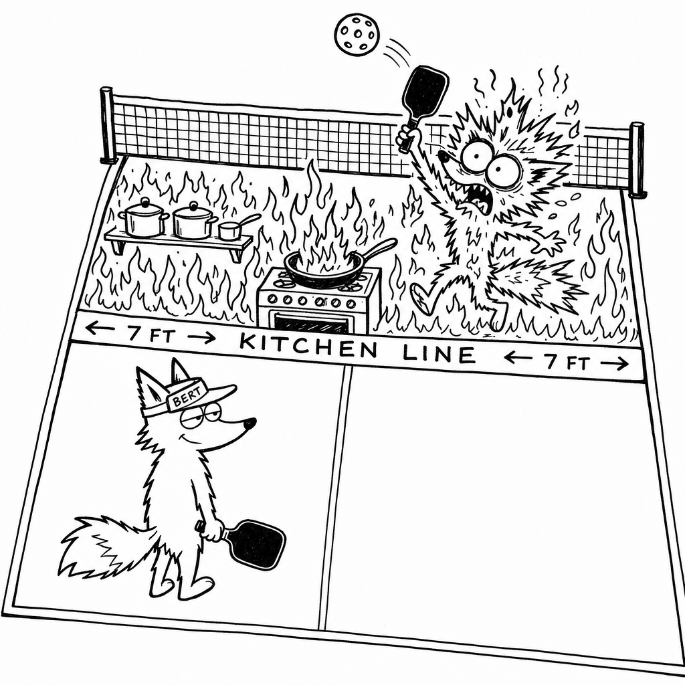

One rule makes it the Kitchen:

**You can't hit the ball out of the air while you're standing in it.**

Out of the air, before it bounces — that's a **volley.** You may not volley with so much as a toe on the Kitchen, or even the line. The line *is* the Kitchen. The line is lava.

I cannot stress the lava enough. People lose whole tournaments to a quarter-inch of shoe and a half-second of joy. A man I knew stepped on the line celebrating a winner — the winner didn't count — and he has, in some quiet way, never come all the way back. I think about him during thunderstorms.

Anyway. It's a rectangle.

But — everyone gets this backwards — the second the ball **bounces,** the Kitchen loses all its power. Bounce first and you can stand in there and do a little dance. Off the bounce you're a welcome guest. Out of the air you're trespassing. That's the whole Kitchen: a box with one rule and a bad attitude.

> **WHY "KITCHEN," THOUGH?** No one is certain, and everyone is confident — the exact two conditions under which pickleball does all of its naming. The leading theory is a hand-me-down from **shuffleboard,** where the *kitchen* is the scoring area you're punished for landing in. The word wandered over, nobody filed the paperwork, and now a sport with no kitchen has a Kitchen — fiercely guarded, impossible to cook in. Don't go looking for the stove. There is no stove. There was never a stove. Let it go, Pemberton. I had to.

> **ALSO ILLEGAL, somehow:** your hat. If your hat falls into the Kitchen after a volley, you lose the point. Your hat. Your sunglasses. Anything that drops off your body into the sacred box during a volley counts. Erne has lost three points and one hat this way.

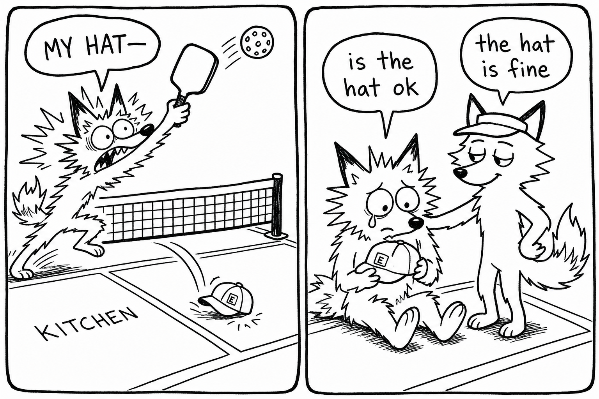

What you *can* do is **reach.** Feet stay home, behind the line; lean your arm out over the Kitchen and volley a ball hanging above it. The Kitchen is a floor, not a ceiling. It's two-dimensional — it owns the ground, not the sky. Reach in, hit, keep your feet out.

Hold onto this box. Everything else in the sport is, in some sense, an argument about it.

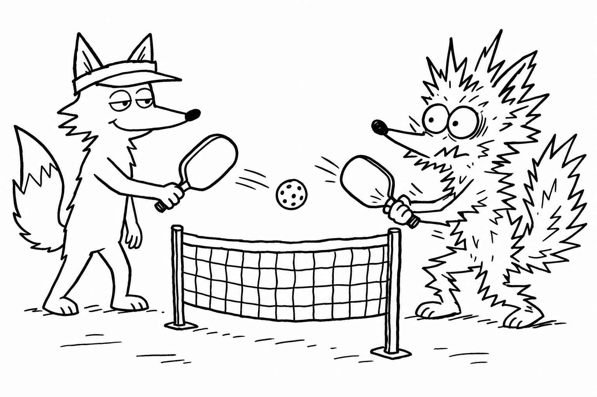

> ### 🥒 DRILL: Volley Reset (one ball, two people)
> Stand at the kitchen line across from a partner. They tap the ball to different spots around your body; you meet each one with a short, controlled volley **and snap back to ready before the next.** Two rules: never let your feet drift into the Kitchen, and anything at your body, take as a **backhand.** The whole sport in miniature: hold your ground, reset, don't reach for glory. *Bert could do this all day. Erne lasts about four balls.*

---

## Chapter 2 — The Two-Bounce Rule, or: wait

Most sports let you serve and immediately charge in and smash somebody. Pickleball wrote *waiting* into the law.

Into the *law,* Pemberton. A sport that makes you wait two whole bounces before you're allowed to want anything. I find that unbearably hopeful and I'm not going to tell you why.

Okay. The fight.

The law:

1. Serve. It has to bounce before the other side hits it.
2. They return it. *That* has to bounce before your side hits it.
3. *Now* anyone can hit it out of the air.

One bounce each side. Then it's a real fight.

Why? Because without it, the serving team would sprint in and crush the return and the point would be over before it began. The rule forces a couple of slow beats at the top of every point. It also, quietly, hands the *returning* team a free trip to the net. Remember that. It comes back — it's the secret engine of the whole next few chapters.

> **THE MOST COMMON TRAGEDY IN THE SPORT:** Erne serves. Erne's body, full of tennis and coffee, sprints for the net. The return lands at his feet, screaming. He either swats it illegally or backpedals like a startled crab. Both lose the point; one is funnier. The cure is three words you should tattoo somewhere visible: **serve and stay.** You serve. You stay. You become a lake.

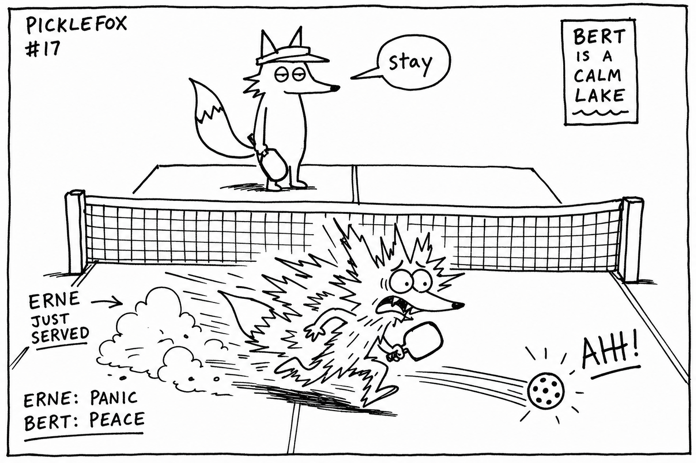

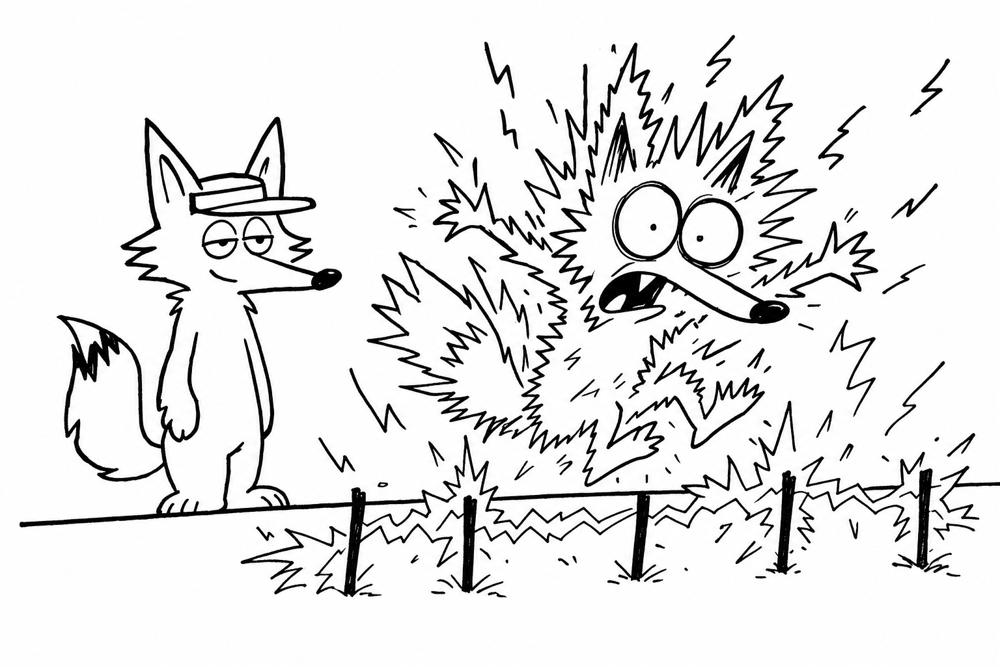

> ### 🥒 DRILL: Serve & Stay, Return & Run (the "Electric Fence")
> The best beginner game there is, and it teaches good habits by *bribing* you. Play normal points, two house rules:
> - **The serving team may not cross the baseline** until the ball has crossed the opponents' kitchen line. Pretend the baseline is an electric fence. This cures the creep-forward-after-serving disease.
> - **If the serving team's third shot lands short** (in front of the receivers), the servers win the point instantly. This bribes the servers into a soft deep drop, and bribes the receivers into *hustling* up to volley instead of backing up.
>
> Every rule sneaks a good instinct into you. Play it a week and your footwork fixes itself.

---

## Chapter 3 — Everybody's standing weird (on purpose)

Because of the Two-Bounce Rule, every point opens with the four players in a slightly lopsided little tableau:

<figure class="court-fig">
<svg viewBox="0 0 340 560" role="img" aria-label="A regulation pickleball court, to scale, with the doubles starting formation">
<defs><pattern id="netmesh" width="7" height="8" patternUnits="userSpaceOnUse"><path d="M0 0V8M3.5 0V8" stroke="#e8eae4" stroke-width="0.6"/></pattern></defs>
<rect x="50" y="36" width="244" height="484" rx="6" fill="#4f6b4a"/>
<rect x="72" y="58" width="200" height="440" fill="#43748f"/>
<rect x="72" y="208" width="200" height="70" fill="#b06848"/>
<rect x="72" y="278" width="200" height="70" fill="#b06848"/>
<g fill="none" stroke="#f4efe2" stroke-width="2">
<rect x="72" y="58" width="200" height="440"/>
<line x1="72" y1="208" x2="272" y2="208"/>
<line x1="72" y1="348" x2="272" y2="348"/>
<line x1="172" y1="58" x2="172" y2="208"/>
<line x1="172" y1="348" x2="172" y2="498"/>
</g>
<rect x="66" y="274" width="212" height="8" fill="url(#netmesh)"/>
<line x1="66" y1="274" x2="278" y2="274" stroke="#f7f4ea" stroke-width="1.4"/>
<line x1="66" y1="282" x2="278" y2="282" stroke="#cfd2c9" stroke-width="1"/>
<circle cx="66" cy="278" r="4" fill="#23262a"/><circle cx="278" cy="278" r="4" fill="#23262a"/>
<g stroke="#6b5f47" stroke-width="1">
<line x1="40" y1="58" x2="40" y2="498"/><line x1="36" y1="58" x2="44" y2="58"/><line x1="36" y1="498" x2="44" y2="498"/>
<line x1="72" y1="530" x2="272" y2="530"/><line x1="72" y1="526" x2="72" y2="534"/><line x1="272" y1="526" x2="272" y2="534"/>
<line x1="308" y1="208" x2="308" y2="278"/><line x1="304" y1="208" x2="312" y2="208"/><line x1="304" y1="278" x2="312" y2="278"/>
</g>
<text x="30" y="278" text-anchor="middle" transform="rotate(-90 30 278)" class="cl-dim">44 ft</text>
<text x="172" y="545" text-anchor="middle" class="cl-dim">20 ft</text>
<text x="324" y="246" text-anchor="middle" transform="rotate(-90 324 246)" class="cl-dim">7 ft</text>
<text x="172" y="248" text-anchor="middle" class="cl-kw">kitchen</text>
<text x="172" y="318" text-anchor="middle" class="cl-kw">kitchen</text>
<path d="M222,470 C176,392 138,250 124,128" fill="none" stroke="#f6d24c" stroke-width="1.8" stroke-dasharray="4 4" opacity="0.95"/>
<polygon points="124,122 117,135 131,131" fill="#f6d24c"/>
<circle cx="222" cy="478" r="9" fill="#f6d24c" stroke="#23262a" stroke-width="2"/>
<circle cx="122" cy="478" r="9" fill="#f6d24c" stroke="#23262a" stroke-width="2"/>
<circle cx="122" cy="78" r="9" fill="#f4efe2" stroke="#23262a" stroke-width="2"/>
<circle cx="222" cy="196" r="9" fill="#f4efe2" stroke="#23262a" stroke-width="2"/>
<g>
<rect x="165" y="170" width="114" height="15" rx="3" fill="#f4efe2" stroke="#caa37e"/>
<text x="222" y="181" text-anchor="middle" class="cl-pl">returner's partner — up!</text>
<rect x="92" y="50" width="60" height="15" rx="3" fill="#f4efe2" stroke="#caa37e"/>
<text x="122" y="61" text-anchor="middle" class="cl-pl">returner</text>
<rect x="195" y="490" width="54" height="15" rx="3" fill="#f4efe2" stroke="#caa37e"/>
<text x="222" y="501" text-anchor="middle" class="cl-pl">server</text>
<rect x="79" y="490" width="86" height="15" rx="3" fill="#f4efe2" stroke="#caa37e"/>
<text x="122" y="501" text-anchor="middle" class="cl-pl">server's partner</text>
</g>
</svg>
<figcaption>A regulation court, to scale — 44 × 20 ft, with a 7-ft kitchen on each side of a 34–36 in net, and 15 × 10 ft service boxes. Amber = serving team, cream = receiving; the dotted line is the cross-court serve.</figcaption>
</figure>

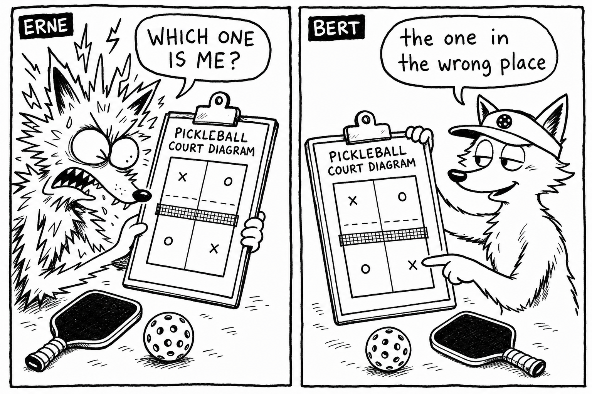

Three of them loafing at the back. And **one lonely soul already up at the net** — the returner's partner. Why does *he* get to be up there?

Because nobody can stop him. He's not returning the serve and not on the serving team, so the two-bounce thing never traps him — first ball he's allowed to touch, he's allowed to volley. So he strolls up to the best seat in the house, the kitchen line, and sits down.

The whole opening of every point is the other three trying to get up there too, and the rules deciding who's allowed, and when. That's the secret choreography. You'll see it now. You won't be able to stop seeing it.

You'll see it at dinner parties. In traffic. In meetings. One person already at the front, three people waiting for a permission the universe quietly handed out at birth —

— okay. That's enough of that. Look at the net. The net is fine.

---

## Chapter 4 — Scoring, which is insane, and which we will survive together

I won't lie to you. This is where new players' eyes go flat and they quietly decide to let their partner keep score for the rest of their natural lives.

Allowed, by the way. There are four people on a doubles court precisely so the odds favor *one* of them knowing the score. Be that one occasionally. That's all anybody's asking.

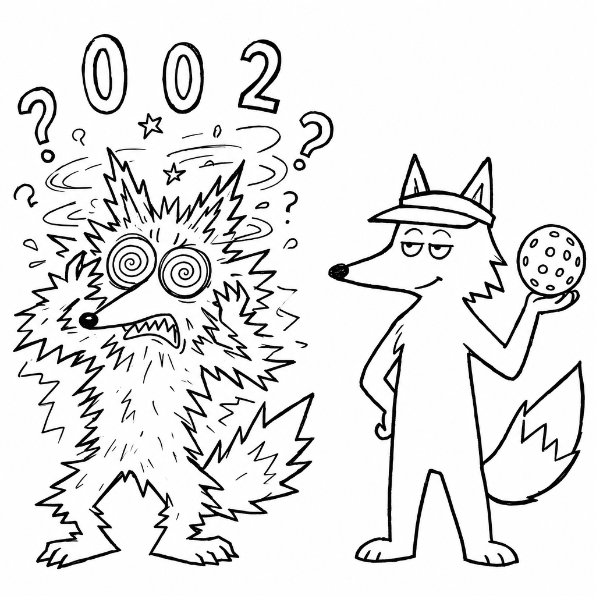

Three numbers. Out loud. Before every serve. Forever. Until the game ends or you do, whichever the score permits.

It's fine. It's fine. We're all fine.

Here's the actual shape of it.

**One: only the serving team can score.** Win a rally while returning and you don't get a point — you get the *serve,* which is nearly as good, because now you can score. Points are a privilege of serving.

**Two: the server calls three numbers, out loud, like a little spell.** *"Four — two — one."*
- your team's score,
- their score,
- which server you are: **1 or 2.**

> **THE PART THAT BREAKS BRAINS:** in doubles, both partners serve before it's the other team's turn. First server loses a rally → it slides to their partner (server 2). Both lose → that's a **side-out,** other team serves. So "0-0-**2**" just means *the second guy's up.*

But there's a stranger one. The very first game *opens* at **0-0-2** — the first team gets only *one* server instead of two. Erne could not get over this. I'll let him explain.

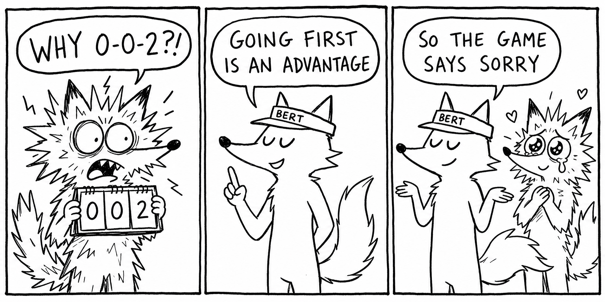

**Three: when you score, you and your partner switch sides.** Only the serving team, only right after a point. The same person keeps serving — they just swap places first. Your side of the court becomes a quiet little clue to the score.

Games go to **11, win by 2.** Then you stop.

> Forget all of it but this: **servers score, call three numbers, switch when you win.** The rest gets into you by accident, through the ancient art of being mildly embarrassed during real games.

---

## An Interlude — a short and mostly true history

*(No drill this time. It's a history lesson. Go get a glass of water; I'll wait.)*

The summer of 1965. Bainbridge Island, just off Seattle. Three dads — a congressman named **Joel Pritchard,** a businessman named **Bill Bell,** and their friend **Barney McCallum** — face the oldest problem on earth: **bored children,** a long afternoon, and no plan for either.

There's an old **badminton** court on the property. There is, crucially, **no shuttlecock** — nobody can find one. So they improvise, the way you improvise an entire sport into existence by accident: a **perforated plastic ball** (the holey, wiffle kind), a few **paddles sawn out of plywood** in the garage, and the badminton net — which, over the afternoon, they keep *lowering,* because the ball is heavy and low and wants to be hit **up.**

Hold that detail. The net got lower because of the ball. The whole soft, upward, kitchen-loving soul of this sport was decided that first afternoon, by a heavy little ball and three tired men nudging a net down until the game felt good.

> **THE NAME. LET US SETTLE THE NAME.** You'll be told it's named after the Pritchards' dog, *Pickles.* Wonderful story. **Not true** — the dog came *later,* and was, if anything, named after the game. The real source is the **"pickle boat":** an old rowing term for the boat thrown together from whatever leftover rowers nobody else picked. A sport stitched from leftover badminton, leftover ping-pong, and a leftover ball is, rather beautifully, a *pickle boat.* The name was Joel's wife **Joan Pritchard's.** She was right. It stuck.

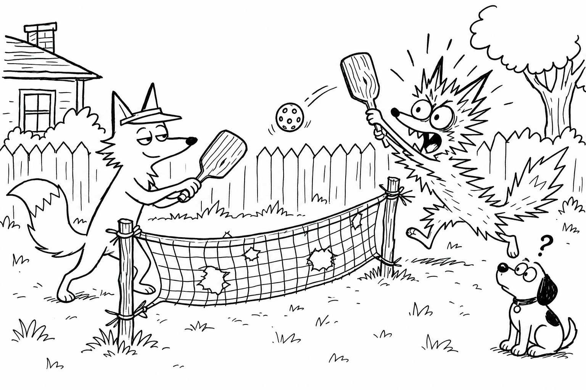

From a bored afternoon on an island it became — and the official course says this with a completely straight face, and it's true — the **fastest-growing sport in the country.** Millions of people. Whole professional tours. A thing your knees now have opinions about.

I tell you this for one reason. The sport was **invented for people who weren't athletes, on an afternoon, to rescue a dull day.** That isn't a sad little origin — it's the entire point, printed into the DNA. Pickleball was never meant to be hard. It was meant to be *yours.*

Now. Footwork.

---

## Part Two — The Fundamentals

Welcome back, Pemberton. Or just *welcome,* if you skipped the rules — I genuinely won't tell, and neither will Bert, who does not gossip, unlike *some* foxes.

The rulebook is behind us. From here it's the real thing — but we start with the **body:** how to stand, how to move your silly little feet, how to swing the five shots, and how to string them into a point. The boring, beautiful mechanics. Get these into your hands and the *thinking* part — the last part, the one where pickleball is actually won — will have something to work with. Bert is delighted. Bert is, of course, not showing it.

---

## The Ladder, the order under the chaos

Before we teach you to *do* anything, Pemberton, here's the shape the whole rest of this book quietly hangs on. The course calls it the *Hierarchy of Assessment,* which is a dreadful name for a lovely idea, so we'll call it what it is: **the Ladder.**

When a good coach watches you play and decides what to fix, they work in a strict order — and it is almost the exact *opposite* of the order you'd guess.

<figure class="ladder-fig">
<svg viewBox="0 0 560 384" role="img" aria-label="The Ladder: anticipation, court position, shot selection, mechanics, ranked top to bottom">
<line x1="32" y1="330" x2="32" y2="58" stroke="#9c4a1f" stroke-width="1.6"/>
<polygon points="32,50 28,63 36,63" fill="#9c4a1f"/>
<text x="18" y="196" class="lnote" transform="rotate(-90 18 196)" text-anchor="middle">what wins games</text>
<line x1="86" y1="44" x2="86" y2="348" stroke="#3a342a" stroke-width="2.6"/>
<line x1="142" y1="44" x2="142" y2="348" stroke="#3a342a" stroke-width="2.6"/>
<line x1="86" y1="80" x2="142" y2="80" stroke="#9c4a1f" stroke-width="4.2"/>
<line x1="86" y1="158" x2="142" y2="158" stroke="#5b6e2c" stroke-width="3.4"/>
<line x1="86" y1="236" x2="142" y2="236" stroke="#7a6a4a" stroke-width="2.7"/>
<line x1="86" y1="314" x2="142" y2="314" stroke="#a2937025" stroke-width="2.2"/>
<line x1="86" y1="314" x2="142" y2="314" stroke="#a29370" stroke-width="2.2"/>
<text x="64" y="85" class="lnum" text-anchor="middle">1</text>
<text x="64" y="163" class="lnum" text-anchor="middle">2</text>
<text x="64" y="241" class="lnum" text-anchor="middle">3</text>
<text x="64" y="319" class="lnum" text-anchor="middle">4</text>
<text x="172" y="76" class="lr top">Anticipation</text>
<text x="172" y="94" class="ld">reading the ball before it's even hit</text>
<text x="172" y="154" class="lr">Court position</text>
<text x="172" y="172" class="ld">being there, balanced, in time</text>
<text x="172" y="232" class="lr">Shot selection</text>
<text x="172" y="250" class="ld">the right shot — usually the boring one</text>
<text x="172" y="310" class="lr">Mechanics</text>
<text x="172" y="328" class="ld">how pretty your swing looks</text>
<text x="448" y="64" class="lnote" text-anchor="middle">↑ won up here</text>
<text x="300" y="366" class="lnote" text-anchor="middle">you start down here — the part you came for, and the part that matters least</text>
</svg>
<figcaption>The whole sport in four rungs. You climb it from the bottom; it's won from the top. Bert lives up near the light. Erne is still clinging to rung four, insisting it's the only real one.</figcaption>
</figure>

That's it. Four rungs, ranked top (matters most) to bottom (matters least):

- **Anticipation** — reading where the ball is going before it goes there.
- **Court position** — being in the right place, balanced, when it arrives.
- **Shot selection** — choosing the right shot, which is usually the boring one.
- **Mechanics** — how pretty your swing looks.

Now notice the joke the whole sport is built on. **Mechanics — the swing, the grip, the thing you came here to learn and the thing every beginner frets about — is the bottom rung.** Dead last. And the three rungs above it, the ones that actually decide who wins, need *no athleticism whatsoever* — just a brain and a few habits. That is the entire reason a calm retiree with a bad knee can dismantle a sprinting twenty-two-year-old: the kid has rung four polished to a shine and *nothing built on top of it.*

Here's the catch, and it's why this book is shaped the way it is. You can only *climb* the Ladder from the bottom — you can't anticipate a ball you can't yet physically hit. So we start you on rung four, the mechanics: the feet, the five strokes, just enough to keep a rally alive. Then, the rest of the way, we climb — position, then selection, then the quiet reading-and-patience that lives at the top, where the air is thin and the Chunky Pickles grow.

So whenever the details start to drown you — and they will; there are a *lot* of details — come back here and ask one small question: **which rung is this?** Almost everything in this book is one of these four things wearing a costume. I'll keep pointing them out: there's a little ladder in the margin at the top of each chapter to tell you exactly where you're standing.

---

## Chapter 6 — The Strokes, in which you finally hit the ball

<svg class="lad" viewBox="0 0 16 20" aria-hidden="true"><line x1="4" y1="2" x2="4" y2="18"/><line x1="12" y1="2" x2="12" y2="18"/><line x1="4" y1="5" x2="12" y2="5"/><line x1="4" y1="9" x2="12" y2="9"/><line x1="4" y1="13" x2="12" y2="13"/><line x1="4" y1="17" x2="12" y2="17"/><line class="on" x1="4" y1="17" x2="12" y2="17"/></svg> on the ladder — <strong>mechanics</strong>, the bottom rung (the part you came for; the part that matters least)

Five shots carry a beginner: the **dink, the volley, the drop, the serve,** and the **groundstroke** (really two shots — the return and the drive — in one swing). Learn these five and you can play. Everything fancier is a remix.

One law rules all five. Tape it inside your skull:

**The ball goes where you point your paddle.** More exactly, every shot's flight is three dials stacked together — **paddle angle + swing path + swing speed.** Want it lower, softer, cross-court? You changed one of those three. That is all technique is. The rest of this chapter is just the five shots' favorite settings.

First, grips, quickly, because they sit under everything:

> **HOW TO HOLD THE THING.** Shake hands with the paddle — that's the **Continental** grip, the one neutral, do-anything grip, and it's the one you want, because it lets you flip forehand-to-backhand without changing a thing, and up at the net you will not have a spare half-second to change anything. **Eastern** (a hair more behind the handle) is fine if you adore your forehand drive. Skip the extreme grips — pickleball's low bounce gives them nothing to chew on. And — everyone, *everyone* gets this wrong — **hold it loose.** *"A loose grip with a firm wrist."* You're holding a bird, not throttling it.

### When to hit it — the five lives of a bouncing ball

One idea runs quietly underneath all five shots, so let's get it out of the way first. A ball, once it bounces, does not politely sit there waiting for you. It *rises to a peak and falls again,* and **where in that little arc you choose to meet it changes everything.** The course gives the flight five names, and pairs each with a shot.

<figure class="bounce-fig">
<svg viewBox="0 0 600 300" role="img" aria-label="The five lives of a bouncing ball: half-volley, on the rise, peak, descent, downfall">
<line x1="24" y1="262" x2="576" y2="262" stroke="#3a342a" stroke-width="2"/>
<g stroke="#7a6f54" stroke-width="1" opacity="0.6"><line x1="60" y1="262" x2="54" y2="272"/><line x1="150" y1="262" x2="144" y2="272"/><line x1="240" y1="262" x2="234" y2="272"/><line x1="360" y1="262" x2="354" y2="272"/><line x1="450" y1="262" x2="444" y2="272"/><line x1="540" y1="262" x2="534" y2="272"/></g>
<path d="M70,262 Q300,-122 530,262" fill="none" stroke="#3a342a" stroke-width="1.6" stroke-dasharray="2 6" opacity="0.55"/>
<g stroke="#9c4a1f" stroke-width="1.4"><line x1="66" y1="255" x2="61" y2="248"/><line x1="74" y1="255" x2="79" y2="248"/><line x1="70" y1="253" x2="70" y2="245"/><line x1="526" y1="255" x2="521" y2="248"/><line x1="534" y1="255" x2="539" y2="248"/><line x1="530" y1="253" x2="530" y2="245"/></g>
<g fill="#fff" stroke="#3a342a" stroke-width="1.6">
<circle cx="116" cy="193" r="9"/><circle cx="194" cy="111" r="9"/><circle cx="300" cy="70" r="11" stroke="#9c4a1f"/><circle cx="406" cy="111" r="9"/><circle cx="484" cy="193" r="9"/></g>
<g fill="#3a342a"><circle cx="113" cy="191" r="1.1"/><circle cx="119" cy="191" r="1.1"/><circle cx="116" cy="196" r="1.1"/><circle cx="191" cy="109" r="1.1"/><circle cx="197" cy="109" r="1.1"/><circle cx="194" cy="114" r="1.1"/><circle cx="297" cy="67" r="1.2"/><circle cx="303" cy="67" r="1.2"/><circle cx="300" cy="73" r="1.2"/><circle cx="403" cy="109" r="1.1"/><circle cx="409" cy="109" r="1.1"/><circle cx="406" cy="114" r="1.1"/><circle cx="481" cy="191" r="1.1"/><circle cx="487" cy="191" r="1.1"/><circle cx="484" cy="196" r="1.1"/></g>
<g class="bn"><text x="116" y="180">1</text><text x="194" y="98">2</text><text x="300" y="55">3</text><text x="406" y="98">4</text><text x="484" y="180">5</text></g>
<text x="116" y="220" text-anchor="middle" class="bp">half-volley</text>
<text x="116" y="236" text-anchor="middle" class="bs">scrape / transition</text>
<text x="186" y="136" text-anchor="middle" class="bp">on the rise</text>
<text x="186" y="151" text-anchor="middle" class="bs">steal time</text>
<text x="300" y="44" text-anchor="middle" class="bp pk">PEAK</text>
<text x="300" y="29" text-anchor="middle" class="bs">returns &amp; dinks · easiest</text>
<text x="414" y="136" text-anchor="middle" class="bp">descent</text>
<text x="414" y="151" text-anchor="middle" class="bs">the drop</text>
<text x="484" y="220" text-anchor="middle" class="bp">downfall</text>
<text x="484" y="236" text-anchor="middle" class="bs">the reset</text>
</svg>
<figcaption>One bounce, five short lives. Hit returns and dinks at the easy <em>peak</em>, drops on the forgiving <em>descent</em>, and panicked resets at the very last <em>downfall</em>.</figcaption>
</figure>

Right off the floor it's a **half-volley** — trapped, low, awkward, an emergency for when you're caught flat-footed in the midcourt. As it climbs you *can* take it **on the rise** to steal time from the other side, though it's easy to jam yourself doing it. At the very top it reaches its **peak,** hanging still for a heartbeat — the easiest ball there is to time, and where you'll hit most of your **returns and dinks.** Just past the top, on the **descent,** is the single most forgiving instant in the sport: your paddle is rising while the ball is falling, and the two meet with enormous margin — this is where the **drop** lives. And right at the bottom, almost a second bounce, comes the **downfall** — the latest, lowest, calmest moment, the one that buys you a precious extra split-second to **reset** a ball someone has fired at you.

You'll meet all five again in the shots just below. For now, two takeaways: the ball is never in a hurry, so neither are you — and your footwork from the last chapter is precisely how you arrive in time to *choose* which of these five moments you want. (When you're unsure how far to move for it, give yourself *too much* room. Overrunning a ball is far easier to fix than getting jammed — you can always step in.)

### The dink — grip pressure 3 or 4 out of 10

A soft shot from up near the kitchen line that floats over and dies in the other Kitchen. No power, no ambition. It just sits there being low and annoying.

But know *why* you're doing it:

> **WE DON'T DINK JUST TO DINK.** The dink isn't patience for its own sake — it's a trap with a soft voice. You dink to **apply pressure:** to draw an error, a kitchen fault, or an impatient pop-up you can then volley away. It only looks like nothing is happening. Something is always happening.

Mechanics: continental grip, paddle up at your waist. **Lunge** into it — weight onto one leg — don't squat down like a chair. Tiny backswing. Swing **low-to-high from the shoulder** — wrist locked, no elbow hinge — at one **constant speed.** Contact **out in front,** ideally at the **peak** of the bounce. Barely any spin; you don't need it.

> **THE #1 DINK ERROR — and it isn't your arm.** If you catch yourself folding at the **elbow,** the real culprit is your **feet** letting the ball get too close. Fix the feet, meet the ball **fully out in front,** and the hinge physically can't happen. (Also: don't let the paddle droop lazily between dinks — snap it back to ready, or the next one eats you.)

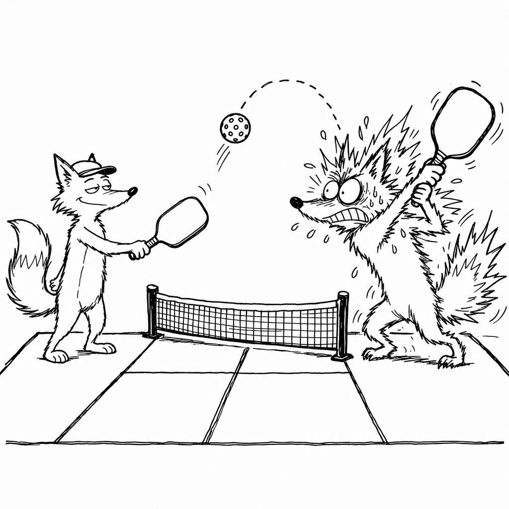

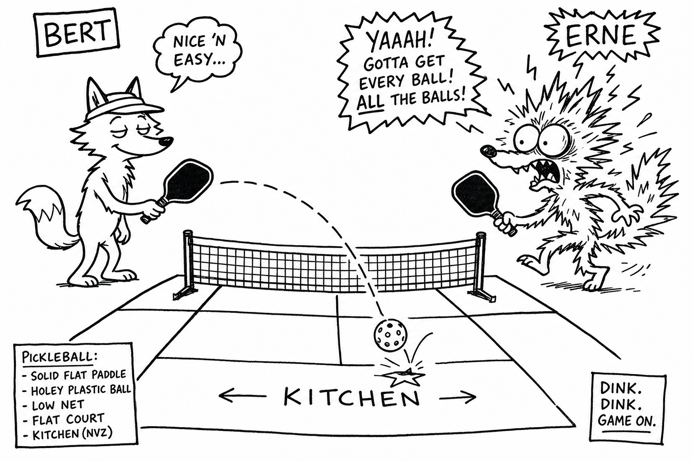

> ### 🥒 DRILL: Dink Evaluation
> Dink cross-court with a partner; a "good" dink lands in their Kitchen. First to 11. Start cooperative, then make it a gentle duel. **Recover toward the middle after each one** — don't camp in the corner; that's not where the next ball is.

I need to tell you something, Pemberton, and it isn't about pickleball.

For eleven months, in my thirties, I tried to become a person who keeps bees. I read the books. I bought the veil. I named the queen — *Brenda* — before she arrived, which the literature specifically and repeatedly warns you not to do. Brenda arrived. Brenda assessed me. Brenda left, in a low brown cloud, over the fence, taking most of the others with her, toward a man named Phil who had done none of the reading and somehow kept four thriving hives and wore a smug little hat about it. I have thought about Phil every single day since.

I bring this up because I want you to know that I understand, from the inside, what it is to be loud and impatient and *trying so hard* at a calm, quiet thing — while a calmer, quieter person wins it without apparent effort directly next door. That is most of pickleball. It was all of the bees. I never did get the bees.

I'd like you to get the pickleball.

Anyway. Where were we.

### The volley — grip pressure 6 to 8

Any ball you hit out of the air, legally, outside the Kitchen. Your weapon at the net.

> **A VOLLEY DOES THREE JOBS AT ONCE:** it **keeps you up** at the line (you don't retreat), it lets you **hit *down*** when the ball's high enough (a downward ball is a misery to answer), and it **steals their reaction time** (you hit it sooner than a bounce would let you). Three gifts, one shot.

Now the contact point, which the videos are unusually honest about:

> **PUNCH LIKE A BOXER — THEN IMPROVISE.** The ideal volley contact is **out in front, about 85–95% of your reach, like a boxer landing a clean punch** — far enough for power, stability, and a quick path back to ready; not so far you're lunging. That's the textbook. Here's the honesty: **you will rarely get the textbook.** Balls come fast and at ugly heights. So you *cheat* — you can still take a ball that's snuck in tight by **opening your hips and turning** to make room (a light paddle and a slow ball make this easy). Don't freeze hunting the perfect contact point. Take the contact you can actually reach, keep the **wrist firm,** and live to hit the next one.

Mechanics: both feet **planted** — never step forward to volley (that's a kitchen fault waiting to happen). Compact swing; *imagine a wall right behind your paddle* so you can't take it back far. Power comes from **shoulder rotation and a firm wrist** — not an elbow jab, and absolutely not a wrist-flick.

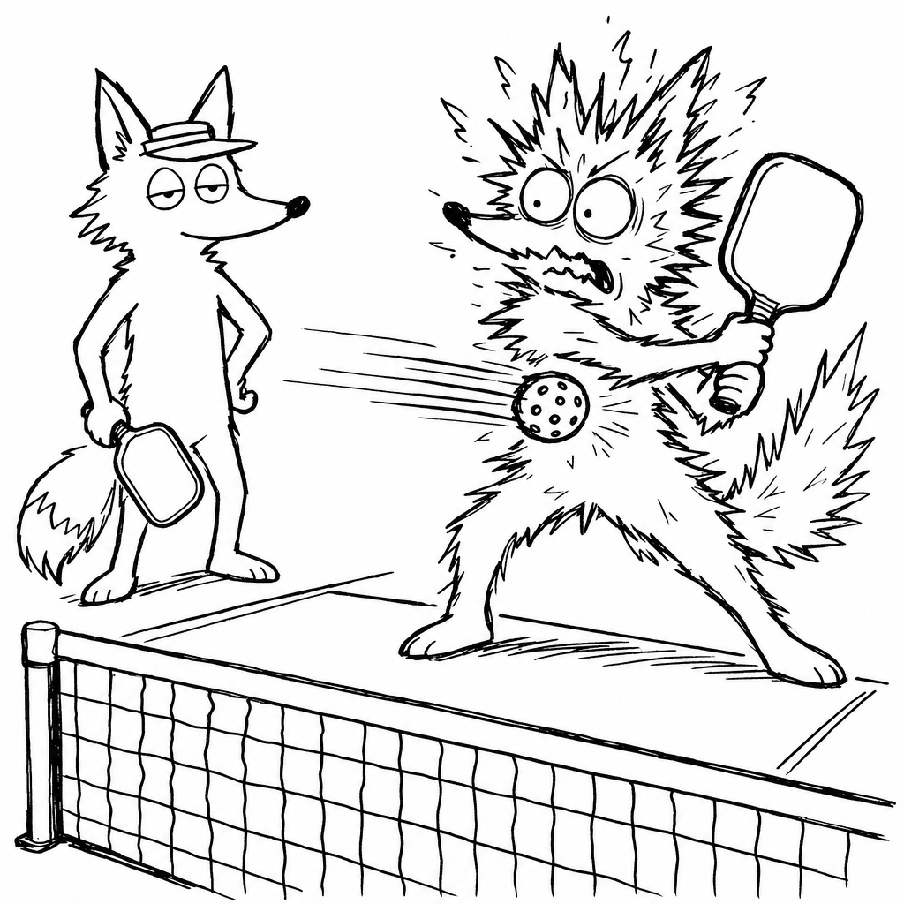

> **BACKHAND IS YOUR FRIEND.** You'll resist this for a month and then trust it forever: **cover your whole body with your backhand.** Anything from your **nose to your knees** — anything inside your dominant shoulder — take as a backhand. It's faster to get the paddle in front of you on that side, and it shields your body. The forehand is only for balls **outside** your dominant shoulder. (Erne forehands everything and gets jammed in the ribs. Repeatedly. It's a little sad.)

> **THE SEESAW.** Your paddle and your opponent's ball ride a seesaw. When **their** ball is **low** (they're scooping *up* at it), you can safely **raise** your paddle — nothing fast is coming. When **their** ball is **high** (they're up over it), **drop** your paddle and brace, because a ball is about to be driven at your feet. Read their contact height; set your paddle to the opposite. It buys the half-second between a clean reset and a faceful of pickleball.

And the choice of where to put it: opponents **back** → keep them back. Opponents **up** or stuck in the midcourt → **hit down at their feet.** Don't try to blast a winner *through* people at the net — there's no angle there; you'll just feed them.

### CHUNKY PICKLE

…that wasn't me. That was Erne. He saw this chapter was getting long, panicked that you might be getting bored, and typed a heading. He isn't even in this section. He does this. Ignore it. We were about to do the drop, which is the best shot in the book, so settle back down, Erne, your moment is coming.

### The drop (the third-shot drop) — soft hands, 3 to 4

The famous, feared third-shot drop. And here's the kindest secret in the book: it's just **an elongated dink.** Truly. Same soft hands, same low-to-high lift — only the distance changes. It differs from a dink in exactly one way: where you're standing.

> **THE DROP BUYS TIME, NOT POINTS.** While that soft ball floats, you **walk** all the way up to the kitchen line you never got to take at the start of the point. It's how the serving team pays back the tax the Two-Bounce Rule charged them. Low pressure, high patience. The climb.

Mechanics: get your feet **behind** the bounce, base wide, knees bent, paddle head **below the ball** (footwork, not arm-reach). Contact it **on the descent** —

> **WHY YOU HIT A DROP ON THE WAY DOWN.** The ball is light and full of holes, so it **slows down a lot** the longer it floats — a falling ball is a slow, friendly, forgiving ball. Catch it on the **descent** and your upward swing meets its downward fall, which is the most margin you'll ever get on a shot. The little backspin you'll see is a **by-product, not a chop.** Don't slice at it.

Targeting: **cross-court** (longest runway, lowest net), aimed **at the returner** (always the more off-balance of the two — they just ran in). And the cue worth more than any other on this shot:

> **"Low and far over high and short."** A drop that lands a touch deep and low — even past the kitchen line — is far better than one you cut too fine and dump in the net. Keep it under net height on their side and you've won the exchange before they've touched it.

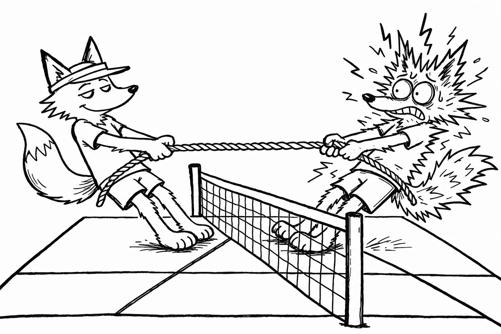

> ### 🥒 DRILL: Tug of War
> Make a good drop → **step back** one step. Miss it → step **forward** one step. After ten balls, whoever ended up **furthest back** wins. It rewards the soft, deep, descending drop and quietly punishes the panicky one — and it teaches your hands what "low and far" feels like without anyone lecturing you.

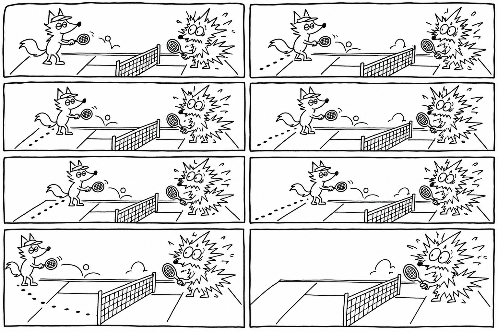

> ### 🥒 DRILL: The Slinky
> Learn the drop without fear. Dink at the kitchen line. Step back, dink again. Another step, another "dink." Keep backing up until you're at the **baseline** hitting "dinks" that are, by any honest measure, **drops** — and nobody told your nervous system to panic. Then walk forward the same way. (Set your feet *before* you hit — never swing while drifting backward.)

### The serve — 6 to 8, but relax your hand

Underhand, low-to-high, cross-court, behind the baseline. Today it has exactly one job: **legal, and in.**

> **THE FIVE RUNGS OF A GOOD SERVE,** in order: (1) **legal** motion, (2) **over** the net, (3) in the **right box,** (4) **every single time,** (5) **deep.** Notice that depth — the only thing beginners chase — comes **dead last.** Earn the first four first.

> **DEPTH IS THE PRIZE; HEIGHT IS HOW YOU BUY IT.** A deep serve shoves the returner back and makes their walk to the kitchen longer. But if you can't get depth with *pace* — and you can't, yet — get it with **height.** A high, looping serve is perfectly legal (they must let it bounce regardless), and the hang time carries it deep. You may, the course notes with a straight face, hit a **lob serve.** It is legal. It is annoying. It works.

Mechanics: continental, stagger your stance with the off-foot forward, and **drop the ball out of a relaxed, falling hand** rather than tossing it up — fewer moving parts, more consistency. One-piece takeaway to your back hip; swing low-to-high on your weight transfer and rotation; finish up over the other shoulder; firm wrist, palm finishing toward the target.

> **TWO SERVE ERRORS TO PRE-EMPT:** opening your chest too early (keep your front shoulder pointed at the target a beat longer), and **falling forward into the court** — finish **behind the baseline,** in ready position, because you still have to let the return bounce. And don't flip to a flat "pancake" grip to loft it.

### The groundstroke — the return and the drive — 6 to 8

A powered forehand or backhand from near the baseline: low-to-high, closed stance, weight transfer and rotation, a **short, abbreviated backswing** (no big tennis loop — no time, no need), firm wrist, finish over the shoulder.

It's really two shots wearing one swing — the **return of serve** and the **third-shot drive.** Same body motion, opposite jobs. And that difference is so important it gets its own chapter. Turn the page.

> **THE GRIP-PRESSURE CHEAT SHEET (out of 10):** dink **3–4** · drop **3–4** · volley **6–8** · serve & drive **6–8.** Soft for the soft shots, firm for the firm ones — never a 9, never a death grip. If your forearm aches after playing, you're squeezing too hard, and you're courting tennis elbow.

---

## Chapter 7 — Building a Point: the serve, the return, the third, the fourth

<svg class="lad" viewBox="0 0 16 20" aria-hidden="true"><line x1="4" y1="2" x2="4" y2="18"/><line x1="12" y1="2" x2="12" y2="18"/><line x1="4" y1="5" x2="12" y2="5"/><line x1="4" y1="9" x2="12" y2="9"/><line x1="4" y1="13" x2="12" y2="13"/><line x1="4" y1="17" x2="12" y2="17"/><line class="on" x1="4" y1="13" x2="12" y2="13"/></svg> on the ladder — <strong>shot selection</strong>, the 3rd rung (with anticipation, rung one, starting to whisper)

Dinking and firefights come later in a rally. But every point *starts* the same way — a little four-shot overture, serve / return / third / fourth, that quietly decides who reaches the kitchen first and who spends the point climbing. Most beginners lose the point right here, in the first four shots, and never notice. So let's build one, shot by shot.

First, the counting, because pickleball people count shots: the **serve is 1, the return is 2, the third shot is 3,** and so on — **odd shots belong to the serving team, even shots to the receiving team.** "Third shot" only tells you *whose* and *when,* not *what,* which is why you hear "third-shot drive" and "third-shot drop."

### Shot 1 — the serve, and a quiet injustice

You serve (legal, deep — see last chapter). But notice the trap the rules set for you: you must **stay back** and let the return bounce. So **the serving team begins every point losing the race to the kitchen.**

Begins it already behind. Through no fault of its own. Punished for the crime of *going first* by a rulebook that does not care about its feelings and was not built for its feelings —

…sorry. That got away from me. The point is: the receivers are already strolling up to the best real estate while you're pinned at the baseline, and everything the serving team does for the next three shots is an attempt to climb out of this hole. Hold that thought; it explains all of it.

### Shot 2 — the return, the most underrated shot in pickleball

Here's the receiver's gift: **while your return is in the air, you get to walk to the kitchen line.** So the return's job is not power. Its job is **depth and time.**

- Hit it **deep** — push the servers back, and buy yourself the long walk in.
- Hit it with **higher net clearance** than feels exciting — height is hang-time, and hang-time is how far you get to walk.
- Hit it at the **peak** of the bounce — don't crowd the baseline; let it rise to the top where it's easy.
- Then **run.**

> **RETURN AND RUN — follow your return to the net 100% of the time.** Not most of the time. Every time. Even a mediocre return you chase in beats a gorgeous one you admire from the baseline, because *you arriving at the kitchen* is worth more than the quality of the shot. And the flip side, in red ink: **never miss a return.** It's the cardinal sin of pickleball — you've handed over a point while making the other team do *nothing.* Get it deep, get it cross-court, and go.

> **THE RETURN IS THE WHOLE SPORT IN ONE SHOT.** You **anticipate** the serve (deep? short?), you take **court position** (set up deep behind the baseline), you make a **shot selection** (high, deep, cross-court), and only *then* do you worry about the **swing.** That order — anticipation, position, selection, mechanics — is the entire Ladder you met at the top of these fundamentals, happening in two seconds. The return is where it all lives at once.

And a bonus the deep return earns you: if it pins the servers so far back they can't even reach their own kitchen line, you've **"expanded the kitchen"** — there's now a wide stretch of open, safe court in front of them to aim into. Hit into that space, not at the line.

### Shot 3 — the third shot, the serving team's problem child

You're stuck back; they own the net. The third shot is your ladder up, and you have two real choices.

**The drop** — soft, into their kitchen — buys you time to walk in, exactly as we covered. The patient climb.

**The drive** — hard and low — and here's the thing nobody believes:

> **THE DRIVE IS NOT A WINNER. IT'S A SETUP.** You do not drive to end the point. You drive to *rush* the net team into a weak, popped-up reply that you put away on the **fifth** shot. Aim a drive **low** — a foot over the net — and **at a person:** the closest player, the body, the middle. Never at the pretty open corner (that's just a ball sailing out — Erne's entire career). If a drive forces an error, lovely; but errors are a **bonus,** never the plan.

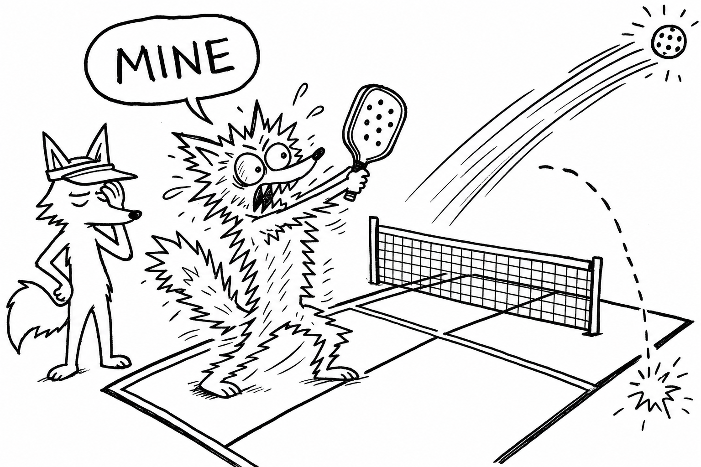

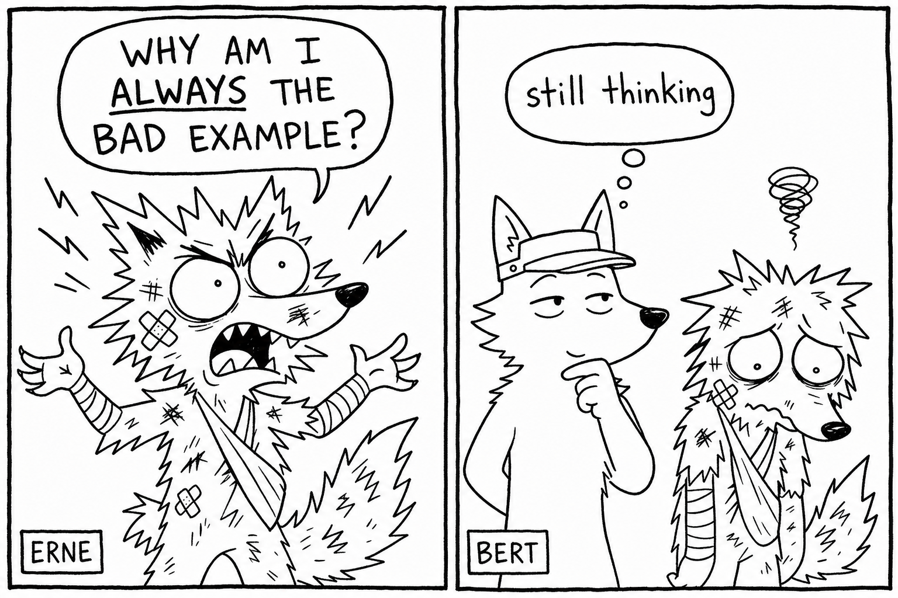

When you *see* a third shot coming, expect them in this order of likelihood: **drive (most common) → drop → lob (rarest).** Bet accordingly.

The return and the drive are the same swing with opposite intentions — learn to tell them apart and you understand the opening of every point:

| | **Return** (shot 2) | **Drive** (shot 3) |
|---|---|---|
| Who hits it | receiving team | serving team |
| The job | depth, consistency, **time** to get in | **rush** them into a weak ball — a setup |
| Net clearance | **higher** (hang-time) | **lower** (~a foot) |
| Aim | deep, cross-court | low, at the **closest body / the middle** |

### Shot 4 — the net team's answer, and the one rule that runs everything

You're up at the kitchen; they've just hit a third shot at you. What you do with it is governed by a single rule that, once you own it, you'll use for the rest of your pickleball life:

> **THE RULE OF HIGH-AND-LOW.** If the ball reaches you **high** — high enough to hit *down* on it — **attack the closer, more-advanced player.** Least time to react; jam it at their feet. If the ball reaches you **low** — so low you must lift it — **play it to the *deeper* player** instead, and never hand the player at the net an easy, attackable ball. **High → nearest. Low → farthest.** Write it directly under "serve and stay."

The specific answers:

- **Against a drive:** don't flinch and don't back up — that's what they want. Meet it with a compact counter-punch — **"stick"** it, firm wrist, no real swing — low at their feet, and keep them pinned back.
- **Against a drop:** take it **out of the air** if you can — a higher contact steals their walk-in time. Pin them deep. And **resist** dropping it straight back unless it's a sure winner; a so-so drop just invites them up to the kitchen you're trying to keep them out of.
- **Against a lob:** read it early off their paddle and kill it out of the air at their feet if you can. If it's a *good* deep one over your head — see below.

### The lob, and how to answer one

> **THE OFFENSIVE LOB.** When the net team is crowding the kitchen and you've got a ball you can lift cleanly, a sudden **lob** over their heads flips the entire point — it shoves them off the line and sends them scrambling backward, and now *you* take the net. Right moment: devastating. Wrong moment: a free putaway for them. Read the room.

> **DEFENDING A LOB — go deep, down the middle.** When *you* get lobbed and have to chase one down, the answer is almost always the same: get back, let it bounce if you must, and send it **deep down the middle.** Deep buys you the time to recover to the line; **middle cuts off the angles** they could otherwise hurt you with. Panicking into a fancy angle off your back foot is how you lose the point twice.

### A quiet word for the middle

> **WHEN IN DOUBT, DOWN THE MIDDLE.** A boring ball up the gut is a quietly excellent answer almost any time. The middle is the **lowest part of the net** (34 inches at the center, 36 at the posts), it gives you the **most margin,** it **splits the two opponents** into a who's-got-it standoff, and it **erases their angles.** It wins a shocking number of points against people waiting for you to do something clever.

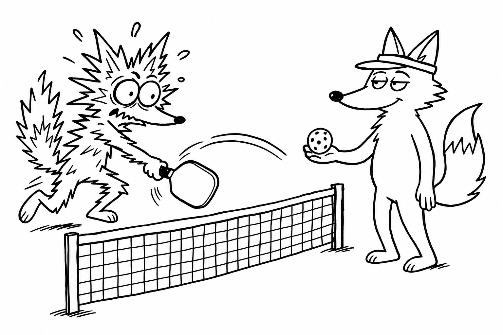

> ### 🥒 DRILL: Serve & Catch
> Serve cross-court; your partner, instead of returning, simply **catches** the ball where it lands and notices where their feet ended up. Trains your serve's depth *and* their return positioning at once. Add a step: let them return-and-catch their own footwork after.

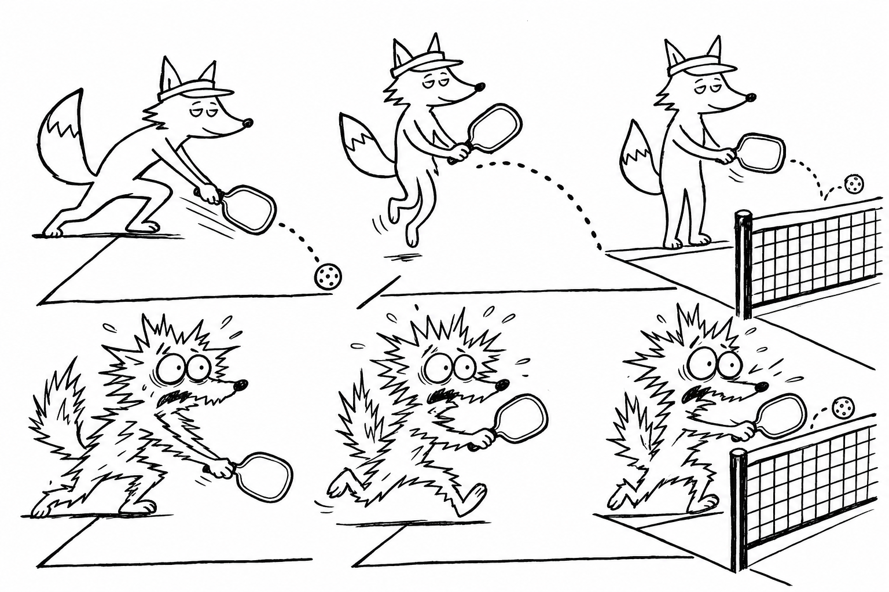

> ### 🥒 DRILL: 3-5-7
> The whole climb in one rep. From the baseline: a **drive** (the 3rd), then a **drop** (the 5th) as you move up, then a **dink** (the 7th) once you've arrived. Drive, drop, dink — the back of the court to the front. The spine of nearly every point you'll ever play.

---

## Part Three — The Thinking Game

You can hit all five shots now, Pemberton. You can stand in the right place and move your feet. Congratulations: you are officially *mediocre,* which in pickleball is much further along than it sounds.

This is the part where you stop *losing.* Nothing left in this book is about hitting the ball better. It's about the quiet stuff that actually decides who wins — why patience beats power, how to survive a firefight without panicking, how to share a court with a partner and a brain, what gear to buy and what to ignore, and, last of all, how to get out of your own way. The mechanics got you onto the court. This is the game that gets played once you're standing on it.

---

## Chapter 8 — The Secret, finally

<svg class="lad" viewBox="0 0 16 20" aria-hidden="true"><line x1="4" y1="2" x2="4" y2="18"/><line x1="12" y1="2" x2="12" y2="18"/><line class="on" x1="4" y1="5" x2="12" y2="5"/><line class="on" x1="4" y1="9" x2="12" y2="9"/><line class="on" x1="4" y1="13" x2="12" y2="13"/><line class="on" x1="4" y1="17" x2="12" y2="17"/></svg> on the ladder — <strong>all of it, at once</strong> (this is the chapter the whole Ladder was for)

You've been patient. Here's the thing that makes pickleball *pickleball* — the thing that lets a retiree with a bad knee take apart a 22-year-old athlete:

**It's a game of errors, not winners.**

Sit with that, Pemberton. The whole sport — the tours, the millions of players, the thing your knees now have firm opinions about — comes down mostly to *two teams standing there waiting for the other one to mess up first.* That's it. That's the engine.

It's so stupid. It's so beautiful. I've been looking at those two sentences for longer than I'd like to admit.

Most sports, you win by doing something amazing. Pickleball, you mostly win by *not* doing something dumb while you wait for the other guy to do something dumb first. Points are given away far more often than they're taken. The most patient, most boring, most relentlessly *correct* player usually walks off with the win.

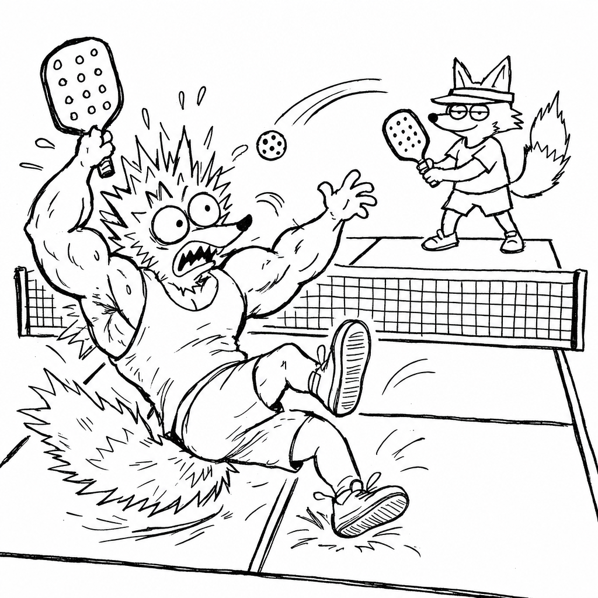

You already know the shape of this. It's the **Ladder** — the one I stood up at the start of the fundamentals and promised we'd keep coming back to. Well: here we are. This is the chapter it was built for, so let's stand it up one last time, because these are the four most important lines in the book.

1. **Anticipation** — reading the ball before it's hit.
2. **Court position** — being in the right *place.* (Mostly: get to the kitchen line, and stay.)
3. **Shot selection** — picking the right shot. (Usually the boring one.)
4. **Mechanics** — how pretty your swing looks.

Every chapter since the Ladder has had a little ladder in its corner telling you which rung it served. *This* is the chapter where they all click together.

> **WHY MECHANICS COME LAST.** The top three need **zero athleticism** — just a brain and some habits — so anyone can adopt them immediately. Mechanics are slow and complex, so they wait. The punchline the course states outright: a team with **worse technique** routinely beats a team with **better technique** through better anticipation, position, and selection. The *only* time you jump straight to mechanics is when a player can't make clean contact at all — then you fix the swing just enough to get them in the rally, and climb back up the ladder.

A player who stands in the right place and picks the boring right shot will dismantle a beautiful athlete standing in the wrong place picking the exciting wrong one. Every time.

You don't have to be fast. Or young. Or strong. You have to be **patient, well-placed, and a little more correct than the person across the net.**

That's the whole book, really. I told you at the start: you have more time than you think. It was true of the ball. It's true of you.

Be Bert. Get to the kitchen line.

And somewhere out past the back fence, low and slow and faintly shimmering, the Chunky Pickle is waiting. Erne still thinks it's a trophy you win by hitting something hard. Erne is about to find out otherwise.

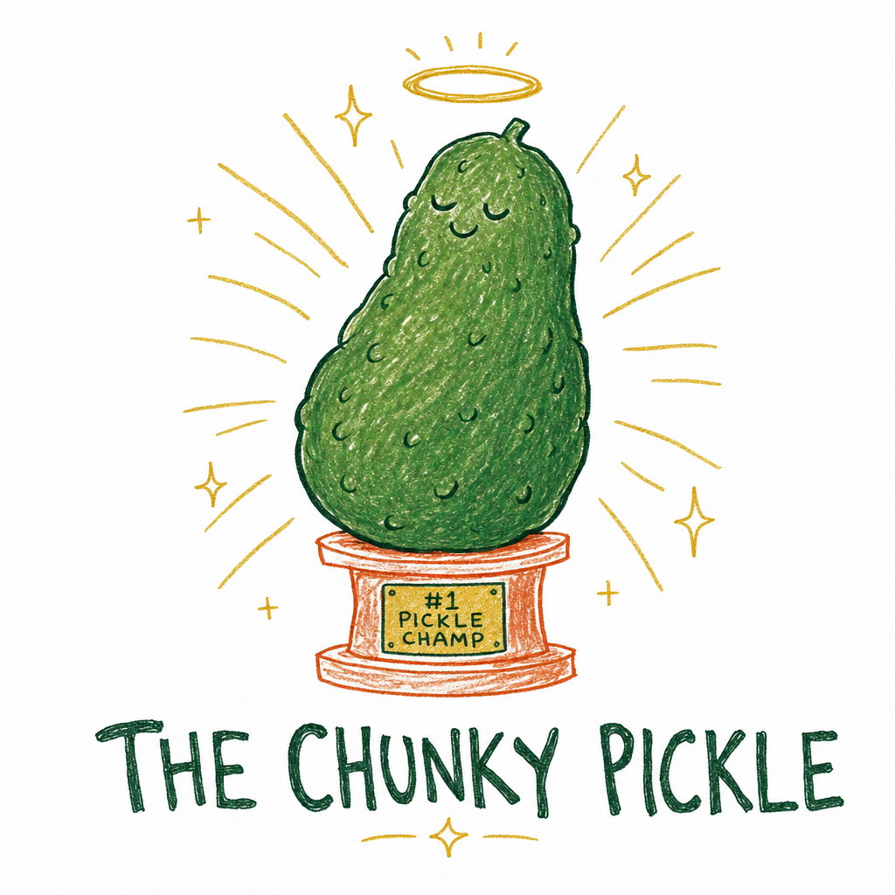

---

## Chapter 9 — The Speed-Up, where Erne lives and dies

<svg class="lad" viewBox="0 0 16 20" aria-hidden="true"><line x1="4" y1="2" x2="4" y2="18"/><line x1="12" y1="2" x2="12" y2="18"/><line x1="4" y1="5" x2="12" y2="5"/><line x1="4" y1="9" x2="12" y2="9"/><line x1="4" y1="13" x2="12" y2="13"/><line x1="4" y1="17" x2="12" y2="17"/><line class="on" x1="4" y1="13" x2="12" y2="13"/></svg> on the ladder — <strong>shot selection</strong>, at a hundred miles an hour

A word with you directly, reader. Just you and me, **Pemberton.** We've been through a lot of dinking together and I feel I can be honest with you now.

Pemberton, you've been so patient. Chapter after chapter of *low and slow, stay out of the Kitchen, dink the nice dink.* You deserve something fast.

Here's the fast thing.

Everybody's at the kitchen line, dinking — those soft, sad, floaty little shots that dare you to do something stupid. Fifteen dinks. Twenty. It's nearly a meditation retreat. And then somebody dinks one *just* a hair too high — chest height, fat and slow and glowing like a tiny full moon —

— and somebody **speeds it up.**

A speed-up is when you take one of those soft balls and suddenly, viciously, hit it *hard,* out of the air, at a human being. The retreat is over. Now it's a knife fight at four feet — both teams flicking the ball at each other's bodies as fast as their hands move. This is called a **hand battle.** Erne calls it "the good part." Erne is wrong about most things, but not that.

> **HOLD ON, says Bert, who has appeared in the margin.** *Pemberton. Look at me. The speed-up is not for winning the point. I know it feels like the whole sport had been building, this entire time, toward you smashing one ball as hard as you can. It wasn't. The speed-up is bait. You hit it to make the other guy panic and pop up a worse ball — and* that's *the one you put away. The first hard ball almost never ends it. Write that down. No — actually write it down. I'll wait.*

Here's what breaks beginners, Erne very much included, forever:

**The one who speeds up first usually loses.**

I know. It's deeply unfair. You did the brave thing, you pulled the trigger — and the *other* guy, the coward, just held his paddle up and let your screaming missile die soft against it, back into the Kitchen. Now he's in control and you're scrambling. How is this justice.

It's justice because of a thing called the **reset,** which is the most important word in this whole violent chapter, so let's leave the violence a moment and —

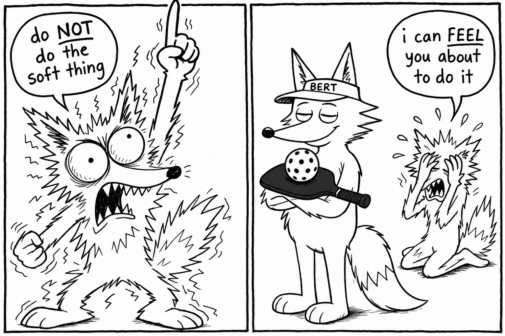

— and talk about something soft and gentle.

A **reset** is when a hard ball comes at you and, instead of swinging hard back — which every cell in your body, and certainly every cell in Erne's, is screaming for — you go limp-wristed and *catch* the pace on your paddle, deadening it, floating it back down into the Kitchen. You take all the speed off. You turn the bullet back into a soft little moon.

> **THE RESET, IN THE COURSE'S OWN TERMS.** Remember the five lives of a bouncing ball? You reset on the **downfall** — the lowest phase — because it buys you the extra split-second to be calm. Hold the paddle **loose** (a 2 or 3 out of 10) so it gives like a catcher's mitt instead of slingshotting the ball back; a tight grip is a trampoline, a loose grip is a pillow. But keep the **wrist firm** so the face doesn't collapse — the course calls this **"stick."** Loose hand, firm wrist, soft target. In a firefight, *be a pillow with a backbone.*

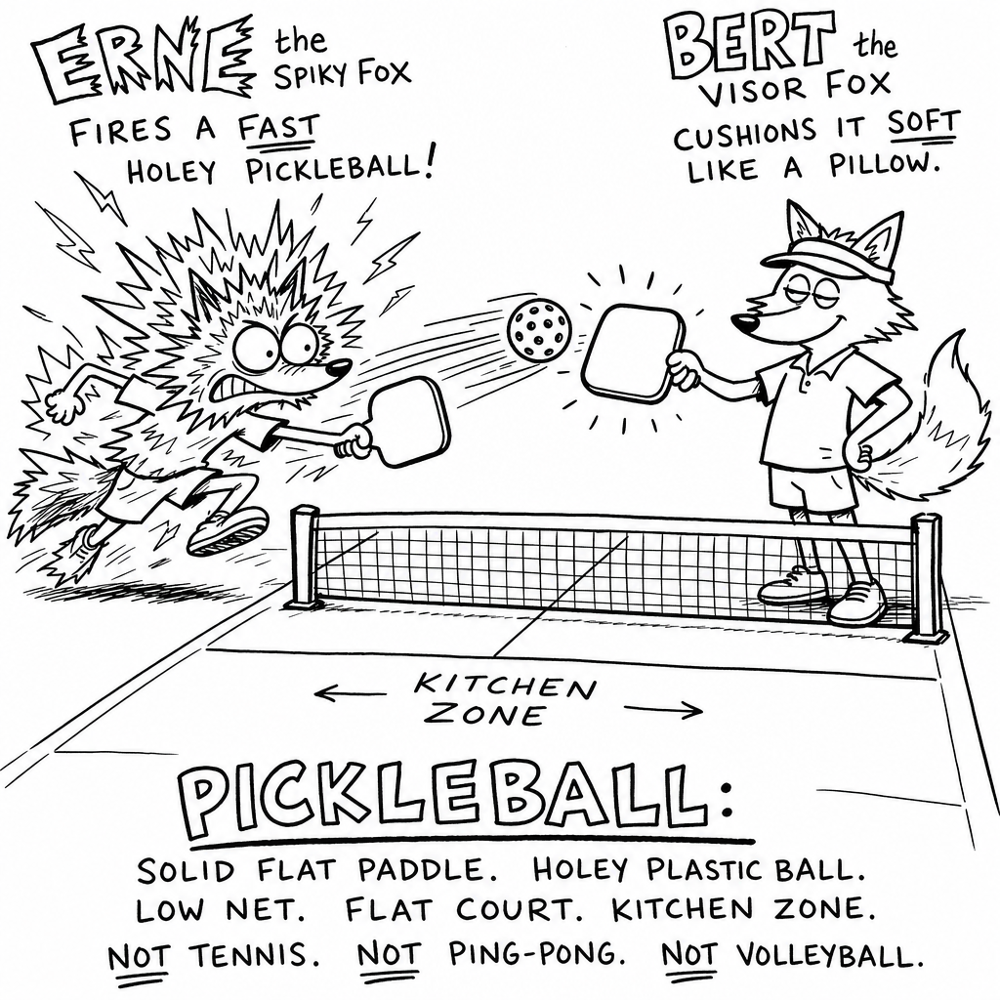

So the real shape of a hand battle: somebody speeds up, hoping you panic. Panic and swing hard, you spray it long. Stay loose and *reset* it soft into the Kitchen, and you've defused the bomb — the point goes back to calm dinking, and now *they're* the frustrated one. The firefight isn't won by the fastest hands. It's won by the calmest. By whoever can be soft while being shot at.

Which is, of course, Bert. It's always Bert.

> **WHERE TO AIM, IF YOU DO SPEED UP:** not the open court. Pemberton, I beg you, not the pretty empty corner. Aim *at the person* — the **dominant shoulder,** or the hip on their paddle side, the awkward spot where they can't decide between forehand and backhand and their own elbow gets in the way. Open space gives them a clean, comfortable reset. The armpit gives them a tiny existential crisis. You want the crisis.

> **WHEN TO SPEED UP AT ALL:** only on a ball you can take **above net height.** If it's low, attacking means lifting, and lifting a ball you're hitting hard means the net or the fence. Low ball: dink it, wait. High ball: *now* you may unleash the Erne within. The discipline isn't "never speed up." It's "only speed up the ball that's begging for it." Erne speeds up every ball, including ones at his ankles, including, on one occasion, a ball that was still in the other guy's hand.

> **THE THREE STAGES OF A NET PLAYER** (so you know where you are): first you learn to **stay neutral** — just reset, don't die. Then to **counterattack** — punish the one ball that deserves it. Then to **read and adapt** — flow between soft and hard without thinking. Most beginners try to start at stage two. Start at stage one. Survive first. The rest arrives on its own.

Now. About the Chunky Pickle.

I see you, Pemberton, still wondering if I'll ever explain it. And Erne's been screaming about it in the margins this whole book — *where is my chunky pickle* — because Erne thinks it's a *prize* you *win* by doing something spectacular. A speed-up so fast they put it on the internet.

That's exactly why Erne will never get it.

The Chunky Pickle doesn't go to the fox who fires fastest. It goes — quietly, no announcement, no highlight reel — to the fox who, while being fired at, stayed soft. Who reset the unresettable ball. Who turned the bullet back into the moon and let the calm resume. Bert has a whole drawer of them. Bert has never once mentioned it. That's the other reason Bert has them.

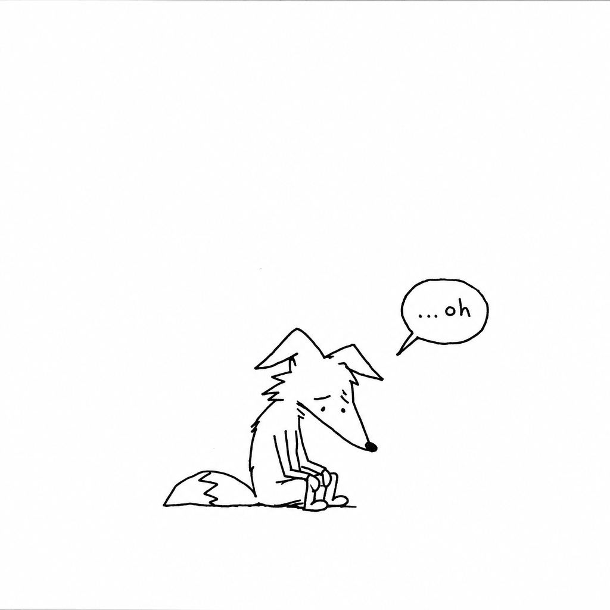

We'll let that sit, Erne. We'll let that one sit.

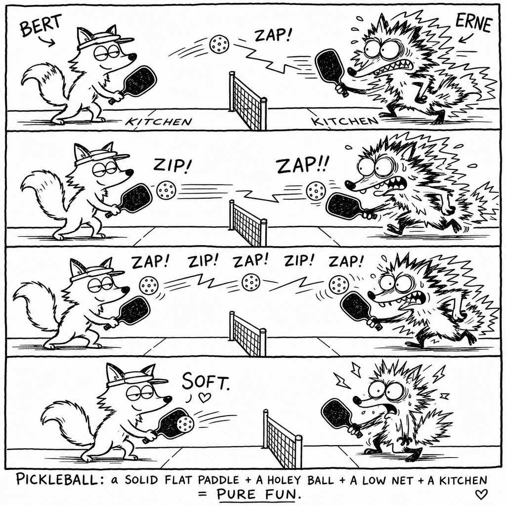

> ### 🥒 DRILL: The Firefight (and how to survive it)
> Two players (or teams) at the kitchen line. Start with cooperative dinking — soft, cross-court, into the Kitchen, just keep it alive. Then add one rule: **either player may speed up at any time, but only on a ball above net height.** Once it happens, it's live hands until someone wins it or, much better, **resets it soft back into the Kitchen** — then you go back to calm dinking and start over.
>
> Score it backwards from how it feels: a point not for winning the firefight, but **every time you reset a hard ball into the Kitchen.** You'll learn in your hands, not just your head, that here, defense is the offense. *Erne goes for the highlight every time and loses. Be the one still standing, soft-handed, when the smoke clears. That fox eats well tonight.*

---

## Chapter 10 — Doubles, where you have a partner and several feelings about them

<svg class="lad" viewBox="0 0 16 20" aria-hidden="true"><line x1="4" y1="2" x2="4" y2="18"/><line x1="12" y1="2" x2="12" y2="18"/><line x1="4" y1="5" x2="12" y2="5"/><line x1="4" y1="9" x2="12" y2="9"/><line x1="4" y1="13" x2="12" y2="13"/><line x1="4" y1="17" x2="12" y2="17"/><line class="on" x1="4" y1="9" x2="12" y2="9"/></svg> on the ladder — <strong>court position</strong>, now with a partner to bump into

Almost all pickleball is doubles. Two of you, two of them, and a small ongoing relationship you didn't entirely plan on.

You will learn things about a person in one doubles game you wouldn't learn in a year of knowing them. Who they blame. Whether they say "mine" and mean it. What their face does when *you* miss an easy one. It's a great deal to find out about somebody on a Tuesday, at a public court, for free.

Anyway. Geometry.

One idea fixes most of it: **you and your partner are tied together by a rope.** A short one — eight, ten feet. When your partner slides to the sideline for a wide ball, the rope drags you the same way, into the middle, covering the gap. You move as one animal. Two people standing in their own little zones is how you lose. A connected pair sliding side to side together is how you don't.

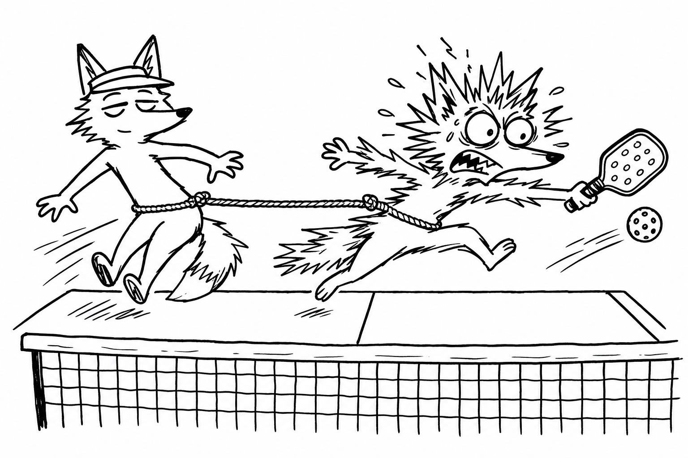

The dangerous place is **the middle.** A ball straight up the gut freezes both players — each one sure the other has it — and it sails between you while you make eye contact. So decide *before* it happens.

The rule, roughly: **the middle ball belongs to the forehand.** Whoever's forehand is in the middle takes it — forehands are stronger and reach farther than backhands. (For two righties, that's usually the player on the left.) And whoever takes it, **say so.** Out loud. Every time.

> **THINGS TO ACTUALLY SAY, OUT LOUD, LIKE A PERSON:** *"Mine." "Yours." "Switch!"* (we're trading sides). *"Bounce it!"* (leave it, it's going out). *"Out!"* Silence loses more doubles points than bad shots do. The quiet, polite team gets carved up. Be a little annoying. Talk.

**Poaching** is darting across to snipe a ball that was technically your partner's — because you can kill it at the net and they couldn't. Glorious when it works. But it opens the door you just walked through, so only poach a ball you can *end.* Never poach a ball you'll merely touch.

(Erne poaches everything. Erne poaches balls on the next court over.)

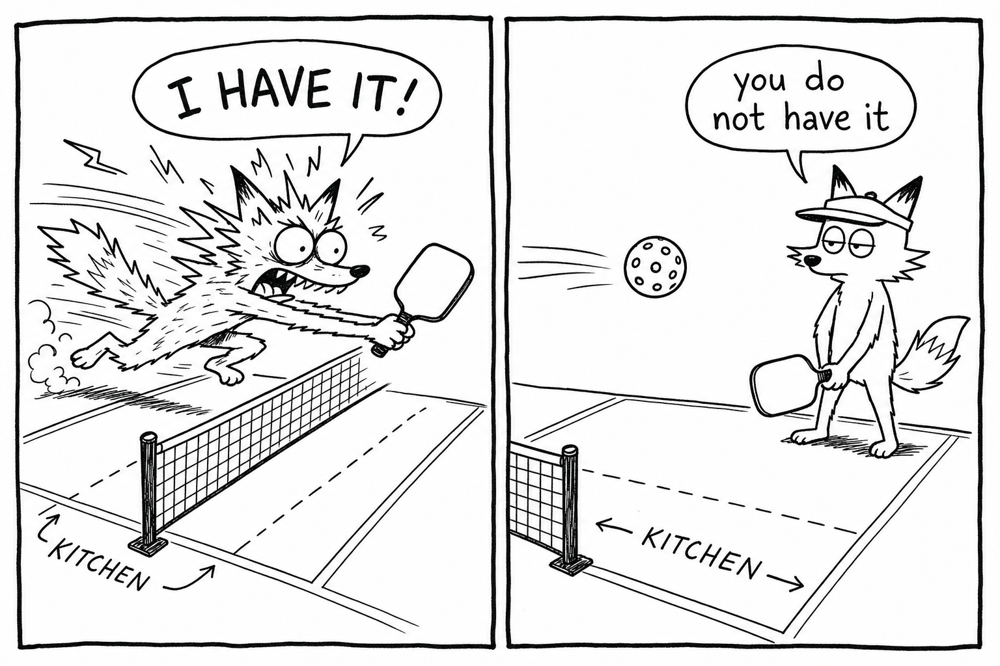

One more, on the house: **stay even.** Both of you up at the kitchen line — or, if you must retreat, both back. The losing shape is one up and one stranded behind, with a beautiful diagonal lane of open court between you. The other team will find that lane. They always find the lane.

> ### 🥒 DRILL: The Tether
> Tie an actual rope between you and your partner — or just imagine a very strict one — about eight feet. A feeder hits balls side to side along your half. Your only job: keep the rope from going slack or snapping. Partner goes wide, you slide in; partner comes back, you come back. No hitting at first — just *move,* glued together, until sliding as one unit stops being a thought and becomes a habit. Then add the ball.

---

## Chapter 12 — Equipment, with the marketing scraped off

You will be told, repeatedly, by people who would like your money, that the next paddle fixes everything. The next paddle does not fix everything. The next paddle is, at best, a slightly nicer way to keep making the same mistake.

But maybe not. Maybe the next one. Maybe the carbon-fiber one with the elongated handle and the thermoformed edge and the name that sounds like a fighter jet. Maybe *that* one finally fixes the hole in y—

No. Court shoes. Get the court shoes. We'll talk about the hole some other time.

That said — a few things are real and worth knowing.

**The paddle.** The only choice that matters early is *control vs. power.* A control paddle is forgiving and holds the ball on the face a beat longer — which is what you want, because your problem isn't a lack of power, it's the ball going where you didn't aim. Pick control. **Lighter** paddles give quicker hands at the net (good in a firefight); **heavier** ones give power and stability but tire your arm. Most people live in the middle, around **7.8 to 8.2 ounces.** The **grip** should fill your hand without cramping it (quick test: your ring finger should *just* reach your palm); when unsure, go smaller and add an overgrip — which you should do anyway, because a sweaty slick grip is how you both shank balls and earn tennis elbow.

**The ball.** Two kinds, and which you use is decided by the **surface, not the building.** **Outdoor** balls are harder and heavier with **40 small holes,** and they fly meaner in wind. **Indoor** balls are softer and lighter with **26 big holes,** and they float. Use whatever suits your court and never think about it again.

**The shoes.** This one's real and isn't marketing: wear **court shoes,** not running shoes. Running shoes are built tall and squishy for going *forward;* pickleball goes *sideways,* and a tall soft shoe rolls your ankle the first time you lunge for a dink. Flat court shoes keep you low and stuck to the floor. Your ankles will write you a thank-you note.

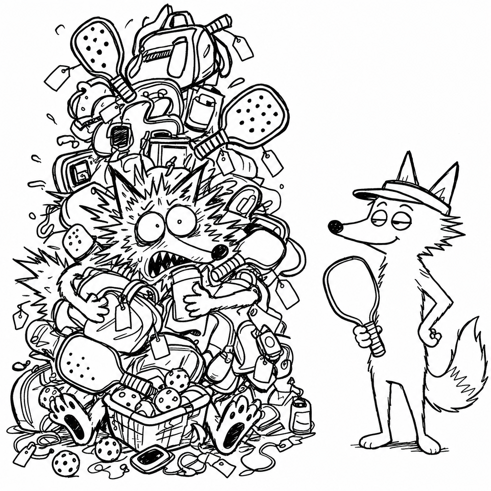

That's the whole equipment chapter. The most expensive paddle in the building loses to a cheap one held with a soft grip by someone standing in the right place. You already know who that someone is.

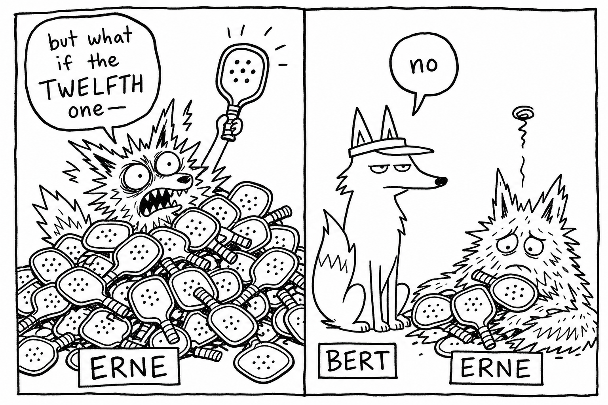

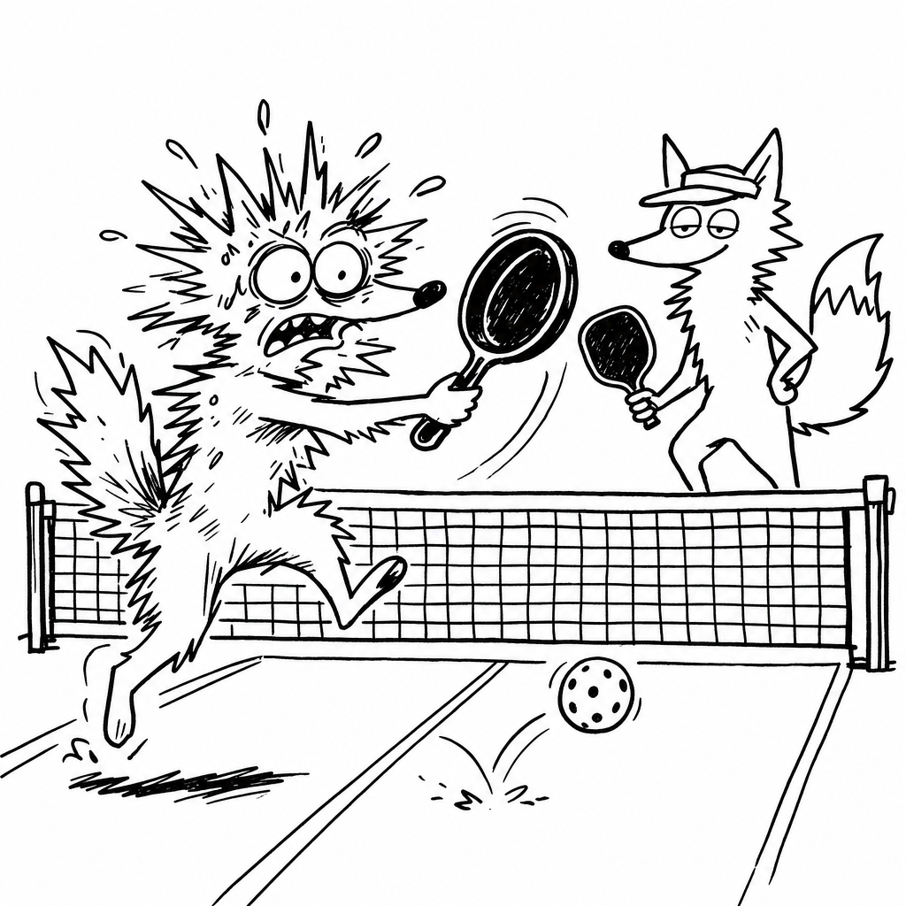

> ### 🥒 DRILL: The Borrowed Paddle
> Play a full game with somebody else's paddle — ideally one you'd never buy. Notice you play almost exactly as well, or as badly, as always. Sit quietly with what that tells you. *This is the only drill in the book with no footwork and a small amount of grief.*

> **WHATEVER HAPPENED TO PIM?** Kind of you to ask. I don't know. That's the whole nature of a Pim: first they're a person you know, then a person you know *of,* then a warm shape with the face slowly sanded off, until all that's left is four hundred yards of streetlight and the small fact that you once forgot to feel your own hand. Your paddle will not do that to you. Hold it the same way every time and inside a year it will know you better than Pim ever got the chance to. That isn't the sad ending. The sad ending is the paddle you left in the closet. Go to the court.

---

## Chapter 13 — The Inner Game, or: the other opponent

<svg class="lad" viewBox="0 0 16 20" aria-hidden="true"><line x1="4" y1="2" x2="4" y2="18"/><line x1="12" y1="2" x2="12" y2="18"/><line x1="4" y1="5" x2="12" y2="5"/><line x1="4" y1="9" x2="12" y2="9"/><line x1="4" y1="13" x2="12" y2="13"/><line x1="4" y1="17" x2="12" y2="17"/></svg> on the ladder — <strong>underneath all four rungs</strong> (it's what holds the ladder up)

There's a person across the net. There is also a person *behind your eyes* — narrating, grading, panicking, issuing instructions you never asked for. The second one is far harder to beat, and you can't side-out your way free of them. They serve every point of your life.

I have to come clean about something, Pemberton. There's a book — *The Inner Game of Tennis,* by a man named Timothy Gallwey, written in the 1970s about tennis — that worked all of this out decades ago, and it's quietly one of the best things ever written about doing *anything* at all. I've been borrowing from it this whole time and dressing the theft up in foxes. So let me finally introduce the foxes properly.

Right at the start of all this — the very first chapter, the two voices — I told you Bert and Erne weren't decoration. That they were *you.* Both of them. And I promised there was a real, almost embarrassing science to why the calm one keeps winning. I've made you wait the whole book for it. Here it is.

They are the two voices that play every shot you will ever hit.

**Erne is the Teller.** The loud one. The part of you that talks *during* the point — *bend your knees, no, not like that, you ALWAYS miss this one, don't choke, oh god why did you do that.* He thinks he's helping. He is narrating you straight into the net.

**Bert is the Doer.** The quiet one. The part that actually hits the ball — the body that already knows how, that produced that one perfect dink last Tuesday while you weren't paying attention, that can catch a tossed set of keys without a single word of instruction. Bert doesn't talk. Bert *can't* talk. Bert just does it, beautifully, the instant the Teller finally shuts up.

> **THE WHOLE THING, IN ONE LINE:** you already have more skill than you're showing. What comes out is your real ability **minus** the interference of the loud one. You mostly don't get better by adding talent. You get better by **subtracting Erne.** Quiet the Teller and the Doer you already have walks out and plays.

Here's the cruel trick, the one that breaks every beginner: **trying harder makes it worse.** The tighter you grip — remember, the bird, not the fist, a 3 out of 10 — the worse the shot. The harder Erne strains to *make* the perfect dink happen, the more thoroughly he strangles the Bert who could simply have *let* it happen.

Let it happen. Don't make it happen.

I know. It's the most annoying sentence in the book. It's also the whole book.

So how do you quiet a voice that won't stop? Not by arguing with it — arguing with Erne is just *more Erne.* You quiet him by taking away his favourite food, which is **judgment.**

Watch what Erne does the instant a shot misses: *that was terrible, I'm terrible, this is hopeless.* Every one of those is a tiny verdict, and every verdict tightens a muscle. The cure is strange, and it works: **stop grading your shots.** Don't call them good or bad. Just *notice* them, like a mildly curious scientist who's never met you. "That one landed long." Not *awful* — just **long.** "Gripped that one tight." Not *I'm choking* — just, huh, **tight.**

A shot you merely *observe,* without the verdict, quietly fixes itself over a few balls — because the body is a magnificent learner and only ever needed clear information, never abuse. Erne thinks his judgments are what's correcting you. They are what's breaking you.

> **CURIOSITY, NOT CRITICISM.** Be a scientist about your own game, not a judge. The scientist asks *"what happened?"* and leans in closer. The judge yells *"bad!"* and tightens up. The body learns from the scientist and flinches from the judge. Same eyes, same shot — completely different muscle.

There's one last move, and it's the most useful thing in this chapter. You can't *order* a mind to be quiet. But you can hand it a small, absorbing job — and a mind with a job is a mind that stops narrating.

The job is: **watch the ball.** Actually watch it — not "I should watch the ball" (that's Erne again), but genuinely *look* at the thing: the little holes, the spin, the seam of it turning in the air. Give Erne the single task of saying, softly, **"bounce"** the instant it bounces and **"hit"** the instant it's struck — yours or theirs. *Bounce. Hit. Bounce. Hit.*

It sounds like nothing. What's actually happening is enormous: Erne, busy with his little job, *stops talking* — and in the silence, Bert, who's been there the whole time, patient and competent and waiting, finally gets to play. That quiet, absorbed, the-world-fell-away feeling you get in a long dink rally? That isn't a side effect of playing well.

**That's the cause.** The quiet comes first. The good pickleball comes out of the quiet.

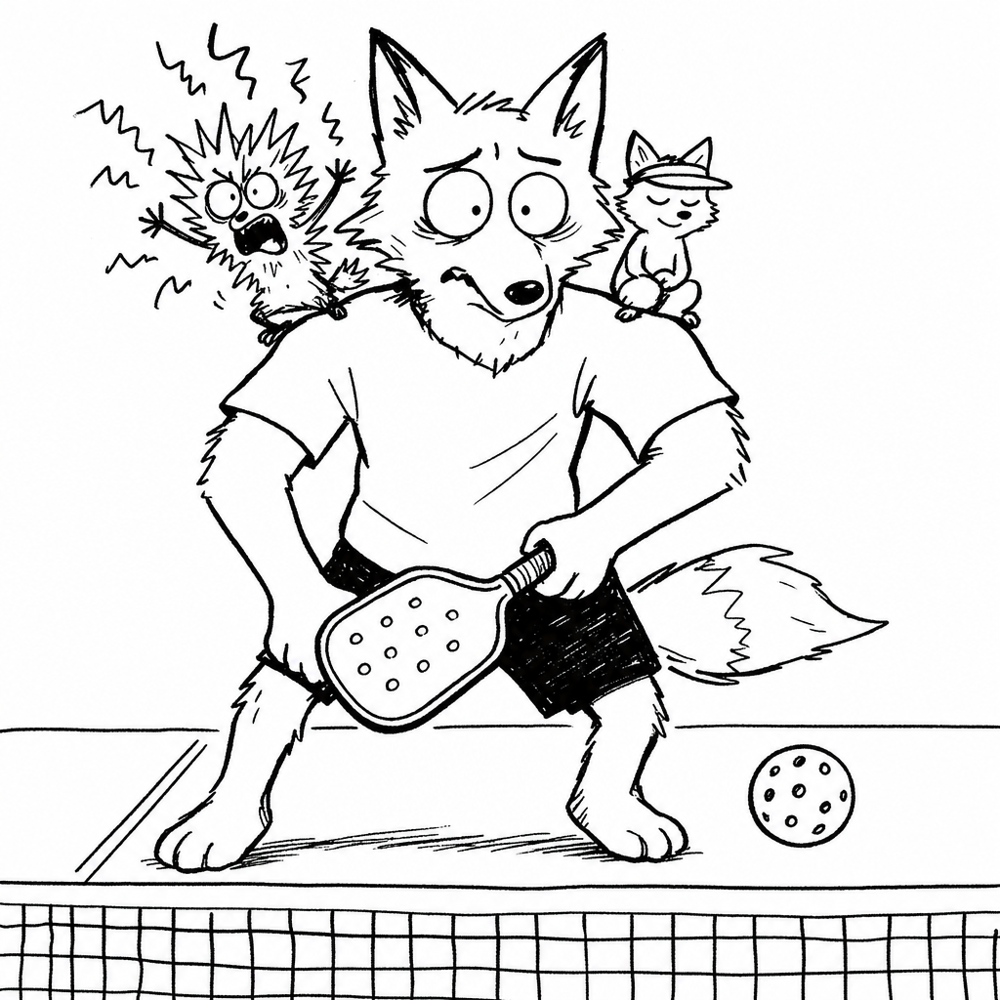

This, in the end, is why Bert keeps winning and Erne keeps losing, and why the Chunky Pickle was never once going to the fox who tries the hardest. It goes to the one who gets out of his own way. Erne can't stop trying. Bert isn't trying at all — Bert is just watching the ball, *bounce, hit,* low and slow, while the point quietly resolves in his favour.

They're both you, Pemberton. The whole game — this one, and the larger one it keeps reminding me of — is just learning to let the quiet one play.

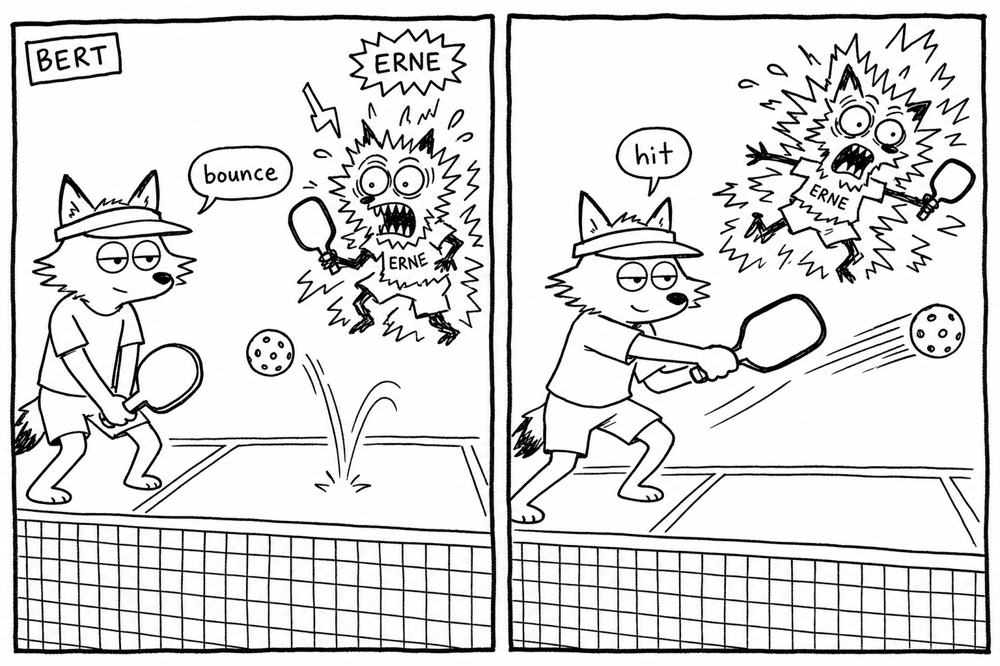

> ### 🥒 DRILL: Bounce–Hit
> Rally or dink with a partner and add one tiny rule: say **"bounce"** out loud the instant the ball bounces, and **"hit"** the instant anyone strikes it. Out loud. Every time. For a few minutes. That's the entire drill. You'll feel the shot-talk — the *don't-miss, elbow-up, oh-no* narration — go quiet, because your attention is busy elsewhere, and you'll feel your timing and contact mysteriously *improve* while you fix nothing at all. You didn't add skill. You subtracted Erne.
>
> **For the brave:** after each of your own shots, say only *where it went* — "long," "net," "in," "deep" — with **no** good or bad attached. Just the fact. Watch how quickly the facts start landing in.

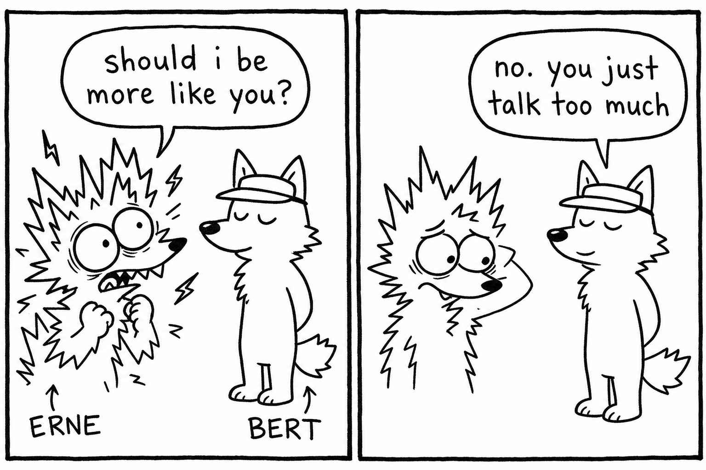

---

## A Glossary, assembled by someone tired of acronyms

Pickleball people love a piece of jargon. Here's enough to fake it.

**Kitchen** — the seven-foot no-volley box at the net. Officially the **Non-Volley Zone,** or **NVZ,** because someone, somewhere, preferred three letters to a perfectly good word about soup.

**Volley** — hitting the ball out of the air, before it bounces. Legal everywhere but the Kitchen.

**Half-volley** — hitting it the instant after it bounces, scraped off the floor. An emergency, and a midcourt survival skill.

**Dink** — a soft shot that lands in the opponent's Kitchen. The most important boring thing in the sport. (We don't dink just to dink.)

**Drive** — a groundstroke hit hard and low. A **setup, not a winner.** Erne's hometown.

**Third-shot drop** — a soft arc from the baseline into the Kitchen; a very long dink, hit on the **descent.** The shot that grows you up.

**Reset** — taking the pace off a hard ball with a soft hand and a firm wrist (**"stick"**) and floating it back into the Kitchen. How calm beats fast.

**Speed-up** — suddenly attacking a soft ball above net height. The opening shot of a hand battle.

**Hand battle / firefight** — a fast exchange of volleys at the net. Won by the calmest hands, not the quickest.

**The seesaw** — their ball low, your paddle up; their ball high, your paddle down. The little law of the net.

**Peak / descent / downfall** — three of the five heights a bounced ball passes through. Returns at the **peak,** drops on the **descent,** resets on the **downfall.**

**Two-Bounce Rule** — the ball must bounce once on each side before anyone may volley. The sport's mandatory patience.

**Side-out** — when both partners have lost their serve and it passes to the other team. The reason scoring takes three numbers.

**Ready position** — knees soft, weight forward, elbows tucked, paddle up at the waist favoring the backhand. Where you should be standing approximately always.

**Split-step** — the little balancing hop you take as your opponent hits. Invisible, essential.

**Poach** — crossing into your partner's side to put a ball away. Heroic when it works, a doorway when it doesn't.

**Stacking** — an advanced positioning trick to keep both partners on their favorite sides. We are not getting into stacking today. We are *protecting* you from stacking today.

**Self 1 / Self 2** — the loud, judging, instructing voice in your head (that's Erne) and the quiet body that already knows how to play (that's Bert). Most of getting good is getting the first one to be quiet so the second one can work. The whole book, more or less. See the chapter on the inner game.

**Bounce–hit** — saying "bounce" when the ball bounces and "hit" when it's struck, to give the loud voice a job and let the quiet one play. Sounds like nothing. Is everything.

**DUPR** — Dynamic Universal Pickleball Rating. One honest number (about 2.0–8.0), built from your real game results, that the sport uses to make fair matches. Useful for finding games; dangerous as a thing to let Erne chew on.

**Erne** — *yes, it's a real shot.* You leap around the outside edge of the Kitchen and volley right by the net, feet landing legally outside the line. Named after a player named Erne. Our Erne is named after the shot, attempts it constantly, and has never once landed it.

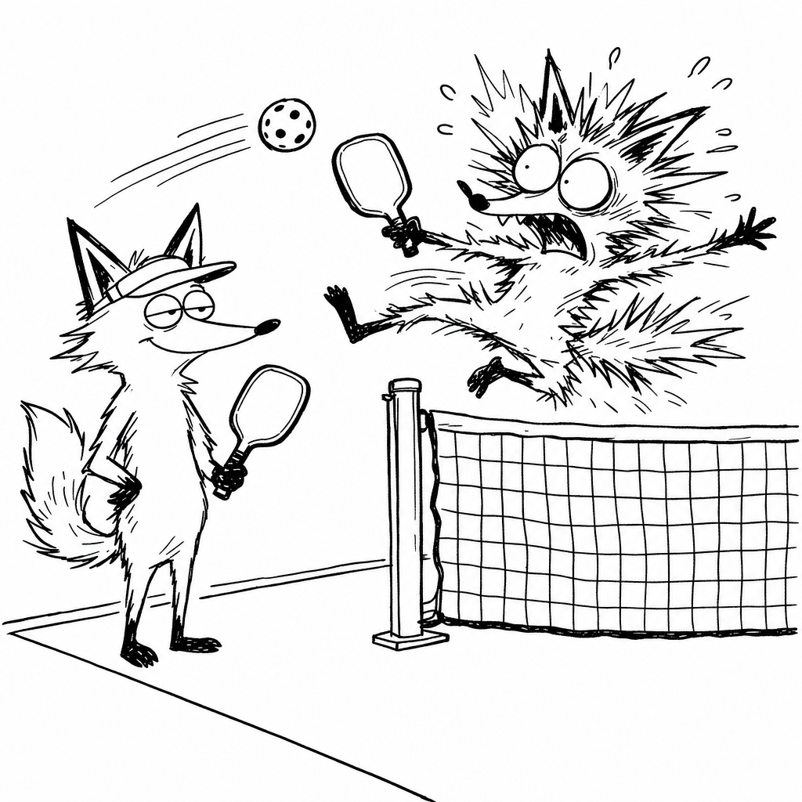

**Bert** — *also a real shot.* It's an Erne you reach by crossing in front of your partner — they set it up, you fly across and finish it. Yes. Our two foxes are named after two real pickleball shots, one calm and one airborne, and we'd like to observe a short silence for how long it took you to notice.

**Chunky Pickle** — [we refer you to the foreword].

---

## The Last Thing — your homework, and then you have to go outside

Every proper lesson, the course insists, ends with **homework.** So here's yours. It's short. Then you have to close the book and go.

- Find a court. Walk to the **kitchen line** and just stand on it. Feel how close the net is. That's home now.
- Hit a hundred **dinks** with anyone willing. Don't try to win a single one. Only try to land them soft and **stay patient one beat longer than the other person.**
- Do the **Slinky** until a drop stops feeling like a dare.
- Play one whole game where your *only* goal is to **never miss a return** and to **follow it in.** Lose gloriously. Learn everything.
- When the ball speeds up, **be a pillow.** When you want to crush it into the open corner, hear Erne in your head — and don't.

That's it. That's the book.

You came here because you'd rather read than be yelled at across a net, and I've respected that the whole way — it's why this is a book and not a clinic. But a book can only walk you to the gate. The rest is reps, and afternoons, and strangers at a paddle rack, and a few hundred soft little shots that go nowhere on purpose.

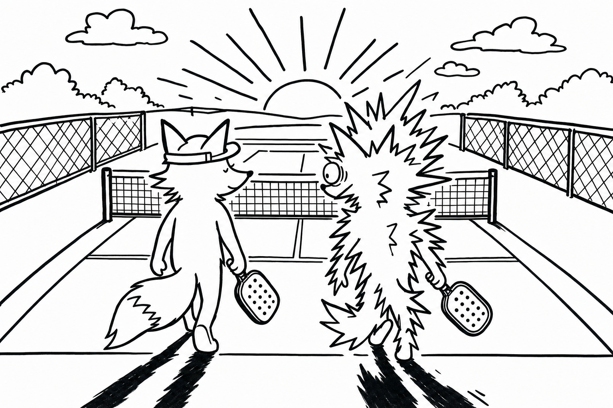

Be Bert. Get low. Get slow. Get to the kitchen line and refuse to lose your patience before the other guy loses his. You have more time than you think — I told you that on the very first page, about the ball, and it was always also about you.

And Erne?

Picture it. Erne's at the kitchen line. A ball floats up to him, chest-high, fat and slow and *begging* to be murdered, every cell in his spiky little body screaming to wind up and end it —

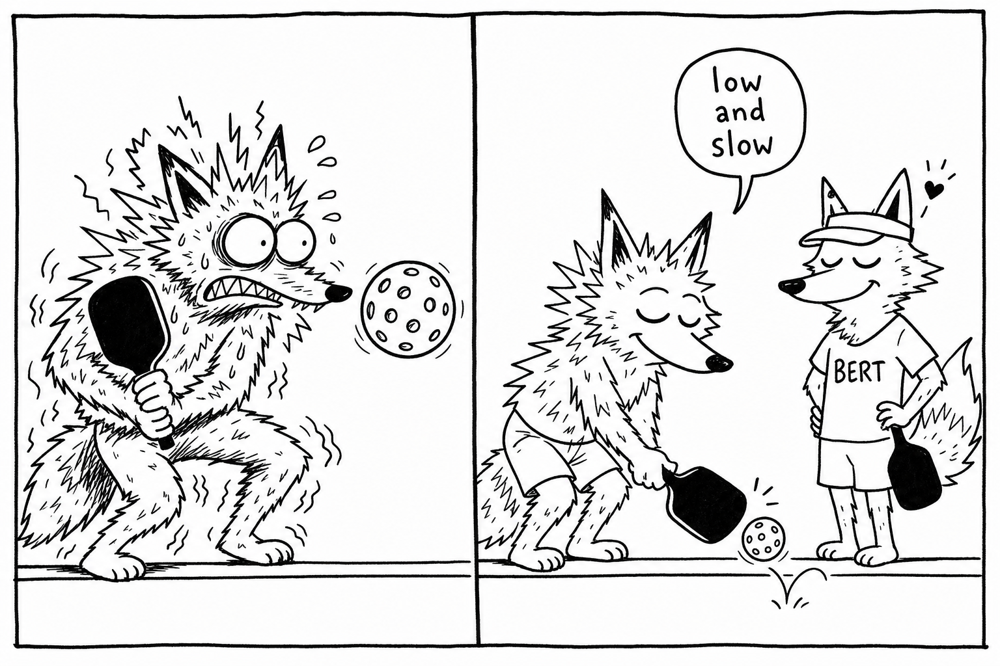

— and he resets it. Soft. Into the kitchen. Nothing flashy. Nothing on the internet.

Bert doesn't say a word. He just reaches under the bench and slides something across, quiet as you like.

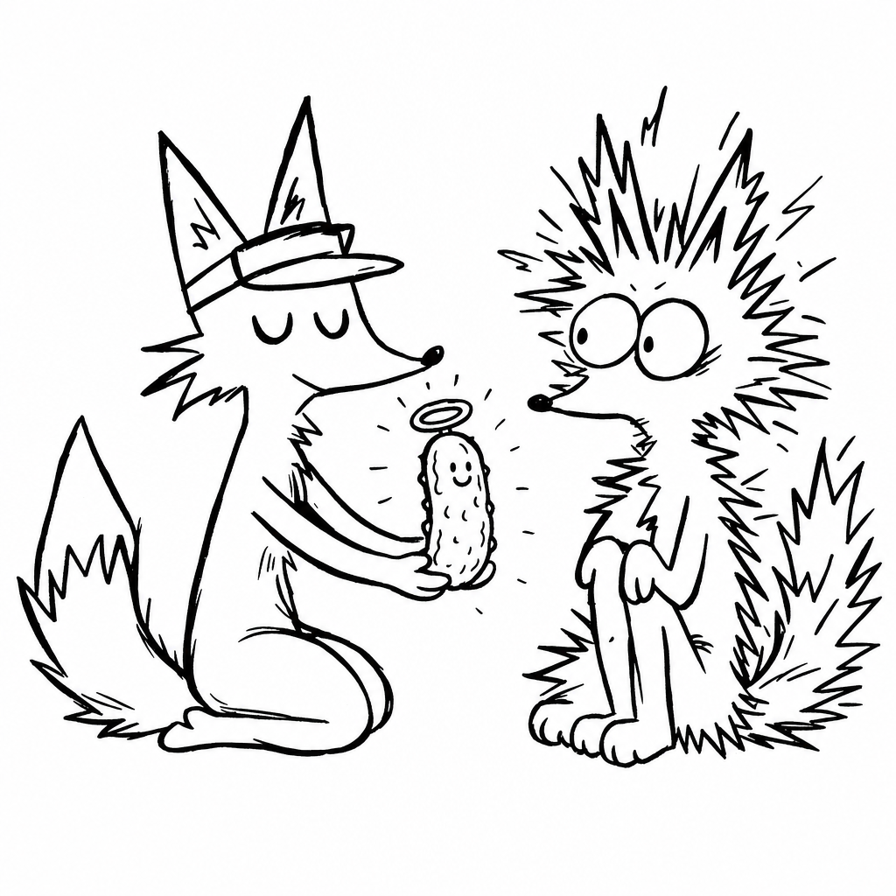

We'll see you out there.

*Low and slow.*
